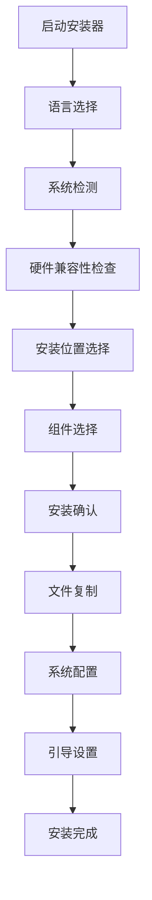

# QEntL 安装器完整规格文档

## 📦 安装器概述

QEntL安装器是一个完整的安装和部署系统，负责将QEntL操作系统安装到目标计算机上，并提供多语言支持、硬件检测和系统配置功能。本文档基于Windows 10安装媒体结构，结合QEntL的特殊需求制定。

## 📋 文件组织分析 - 基于Windows 10参考

### Windows 10安装媒体结构分析
```
Windows 10安装媒体:
├── setup.exe              # 主安装程序 (二进制)
├── bootmgr                # 引导管理器 (二进制)
├── install.esd            # 系统镜像 (4.18GB压缩)
├── boot.wim               # PE启动环境 (519MB)
└── sources/               # 安装支持文件
    ├── *.dll              # 安装DLL库 (二进制)
    ├── *.exe              # 安装工具 (二进制)  
    ├── *.xml/*.inf        # 配置文件 (文本)
    └── lang/              # 多语言包
```

### Windows系统文件分布 (C:\Windows)
```
C:\Windows/:
├── System32/             # 核心系统二进制文件
│   ├── *.exe             # 系统可执行文件
│   ├── *.dll             # 动态链接库
│   └── *.sys             # 设备驱动
├── SysWOW64/             # 32位兼容二进制文件
├── Boot/                 # 启动文件
├── Fonts/                # 字体文件
├── inf/                  # 驱动信息文件
└── Temp/                 # 临时文件
```

## 🎯 QEntL文件组织方案

基于Windows的成功经验，QEntL采用以下文件组织方式：

### 开发阶段文件分布
```
QEntL开发目录:
├── QEntL/System/src/      # 源代码 (.qentl文件)
├── qbc/                   # 编译字节码 (.qbc文件)
├── qim/                   # 镜像文件 (.qim文件)
└── Installer/             # 安装媒体文件
```

## 🏗️ 安装器架构

### 核心组件
```
QEntL Installer
├── 🚀 setup.bat              # 安装入口程序
├── 📋 qentl_installer.qentl  # 主安装逻辑
├── 🔧 qentl_bootmgr.c       # 引导管理器
├── 💿 sources/              # 安装源文件
├── 🛠️ support/              # 支持工具和驱动
└── 📚 docs/                 # 安装文档
```

### 安装流程


## 📋 完整安装介质结构规格

### QEntL-Installer/ 目录结构
```
QEntL-Installer/
├── 🔧 autorun.inf           # 自动运行配置
├── 🚀 setup.bat             # Windows安装启动器
├── 📋 qentl_installer.qentl # 主安装程序
├── 🔧 qentl_bootmgr.c      # 引导管理器源码
│
├── 📁 sources/              # 安装源文件 (5GB)
│   ├── 💿 install.qim       # 主安装镜像 (4.2GB)
│   ├── 💿 boot.qim          # 引导镜像 (500MB)
│   ├── 📄 IMAGE_README.md   # 镜像说明
│   └── 🌐 lang/             # 多语言包 (300MB)
│       ├── zh-CN/           # 简体中文
│       ├── zh-TW/           # 繁体中文
│       ├── en-US/           # 英文
│       └── ja-JP/           # 日文
│
├── 📁 support/              # 支持文件 (1GB)
│   ├── 🔌 drivers/          # 硬件驱动 (800MB)
│   │   ├── quantum/         # 量子硬件驱动
│   │   ├── network/         # 网络适配器驱动
│   │   ├── storage/         # 存储设备驱动
│   │   └── graphics/        # 图形卡驱动
│   └── 🛠️ tools/            # 部署工具 (200MB)
│       ├── diagnostic.exe   # 系统诊断工具
│       ├── recovery.exe     # 系统恢复工具
│       ├── migration.exe    # 数据迁移工具
│       └── partition.exe    # 磁盘分区工具
│
└── 📁 docs/                 # 安装文档 (50MB)
    ├── installation_guide.md      # 安装指南
    ├── system_requirements.md     # 系统要求
    ├── troubleshooting.md         # 故障排除
    └── hardware_compatibility.md  # 硬件兼容性
```

## 🔧 install.qim 镜像内容规格

### 完整内容结构 (4.2GB)
```
install.qim内容:
├── System/                    (2.8GB) # 系统核心
│   ├── bin/                   (800MB) # 二进制可执行文件
│   │   ├── qentl_compiler.exe         # 编译器主程序
│   │   ├── qentl_vm.exe              # 虚拟机主程序
│   │   ├── qentl_runtime.dll        # 运行时动态库
│   │   └── kernel/                   # 内核二进制文件
│   │       ├── qentl_kernel.sys      # 内核系统文件
│   │       └── drivers/*.sys         # 设备驱动
│   │
│   ├── lib/                   (400MB) # 系统库文件
│   │   ├── runtime/                  # 运行时库
│   │   │   ├── core.qbc             # 核心运行时字节码
│   │   │   ├── memory.qbc           # 内存管理字节码
│   │   │   ├── quantum.qbc          # 量子处理字节码
│   │   │   └── system.qbc           # 系统调用字节码
│   │   │
│   │   ├── compiler/                 # 编译器库
│   │   │   ├── parser.qbc           # 语法分析器
│   │   │   ├── optimizer.qbc        # 代码优化器
│   │   │   └── codegen.qbc          # 代码生成器
│   │   │
│   │   └── vm/                       # 虚拟机库
│   │       ├── interpreter.qbc      # 解释器
│   │       ├── jit.qbc              # 即时编译器
│   │       └── gc.qbc               # 垃圾回收器
│   │
│   ├── config/                (100MB) # 系统配置文件
│   │   ├── system.conf              # 系统配置
│   │   ├── kernel.conf              # 内核配置
│   │   └── registry/                # 注册表文件
│   │
│   └── boot/                  (1.5GB) # 启动相关文件
│       ├── bootmgr.exe              # 启动管理器
│       ├── recovery/                # 系统恢复
│       └── firmware/                # 固件文件
│
├── Models/                    (1.0GB) # 四大量子模型
│   ├── QSM/                   (300MB) # 量子叠加态模型
│   │   ├── bin/qsm.exe              # QSM二进制程序
│   │   ├── lib/qsm_core.qbc         # QSM核心字节码
│   │   └── config/qsm.conf          # QSM配置文件
│   │
│   ├── WeQ/                   (250MB) # 量子通讯模型
│   │   ├── bin/weq.exe              # WeQ二进制程序
│   │   ├── lib/weq_protocol.qbc     # WeQ协议字节码
│   │   └── config/weq.conf          # WeQ配置文件
│   │
│   ├── SOM/                   (250MB) # 量子平权经济模型
│   │   ├── bin/som.exe              # SOM二进制程序
│   │   ├── lib/som_economy.qbc      # SOM经济字节码
│   │   └── config/som.conf          # SOM配置文件
│   │
│   └── Ref/                   (200MB) # 量子自反省模型
│       ├── bin/ref.exe              # Ref二进制程序
│       ├── lib/ref_reflection.qbc   # Ref反射字节码
│       └── config/ref.conf          # Ref配置文件
│
├── Programs/                  (200MB) # 预装应用程序
│   ├── bin/                          # 应用程序二进制文件
│   │   ├── qentl_editor.exe         # QEntL编辑器
│   │   ├── quantum_calc.exe         # 量子计算器
│   │   └── system_monitor.exe       # 系统监视器
│   │
│   ├── lib/                          # 应用程序库文件
│   │   ├── editor/                  # 编辑器库
│   │   │   ├── syntax.qbc           # 语法高亮
│   │   │   └── autocomplete.qbc     # 自动完成
│   │   │
│   │   └── ui/                      # 用户界面库
│   │       ├── widgets.qbc          # UI组件
│   │       └── themes.qbc           # 主题系统
│   │
│   └── data/                         # 应用程序数据
│       ├── templates/               # 项目模板
│       └── examples/                # 示例代码
│
├── Users/                     (50MB)  # 用户环境模板
│   └── Default/                      # 默认用户模板
│       ├── bin/                      # 用户二进制工具
│       ├── config/                   # 用户配置文件
│       └── data/                     # 用户数据目录
│
├── Templates/                 (100MB) # 项目模板
│   ├── basic/                        # 基础项目模板
│   ├── quantum/                      # 量子项目模板
│   └── enterprise/                   # 企业项目模板
│
└── Documentation/             (100MB) # 系统文档
    ├── api/                          # API文档 (HTML/PDF)
    ├── tutorials/                    # 教程文档 (HTML/PDF)
    └── reference/                    # 参考文档 (HTML/PDF)
```

### 📝 文件类型说明

#### QBC字节码文件 (.qbc)
QBC (QEntL Byte Code) 是QEntL的字节码格式，类似于Java的.class文件或.NET的IL代码：

- **作用**: 编译后的QEntL源码，由QEntL虚拟机执行
- **位置**: 主要存放在 `System/QBC/` 目录下，按功能模块分类
- **执行**: 运行时由QEntL VM加载和执行
- **性能**: 比源码执行更快，比原生代码更安全

#### 二进制可执行文件 (.exe, .dll)
传统的本机可执行文件：

- **作用**: 直接由操作系统执行的机器码
- **位置**: 存放在各模块的 `bin/` 和 `lib/` 目录下
- **执行**: 直接由CPU执行，性能最高
- **兼容**: 与现有Windows应用程序兼容

#### 源码文件 (.qentl)
QEntL编程语言源代码：

- **作用**: 人类可读的程序源码
- **位置**: 主要用于系统配置、启动脚本等
- **执行**: 需要编译为QBC或直接解释执行
- **开发**: 用于定制化和扩展开发

#### 文件组织原则 (参考Windows)
```
类似Windows的组织方式:
C:\Windows\System32\     → QEntL\System\QBC\      (核心系统字节码)
C:\Windows\SysWOW64\     → QEntL\System\Drivers\  (兼容层驱动)
C:\Program Files\        → QEntL\Models\          (量子模型)
C:\Program Files (x86)\  → QEntL\Programs\        (预装程序)
C:\Users\                → QEntL\Users\           (用户环境)
```

## 🚀 安装模式

### 1. 图形界面安装 (推荐)
```cmd
# 双击运行或命令行启动
setup.bat

# 特性:
- 友好的图形界面
- 多语言支持
- 实时进度显示
- 错误处理和回滚
```

### 2. 命令行安装
```cmd
# 静默安装
qentl_installer.qentl --silent --target "C:\QEntL"

# 自定义安装
qentl_installer.qentl --components "core,dev,quantum" --lang zh-CN
```

### 3. 网络安装
```cmd
# 通过网络下载最新版本
qentl_installer.qentl --online --mirror "https://mirror.qentl.org"
```

## 🔧 安装镜像规格

### install.qim (主安装镜像)
- **大小**: 4.2GB
- **格式**: QEntL压缩镜像格式
- **压缩比**: 65%
- **完整性**: SHA-256 + 量子校验和

#### 镜像内容分布 (参考Windows 10安装媒体)
```
install.qim内容 (4.2GB):
├── System/                    (2.8GB) # 系统核心文件 (类似C:\Windows)
│   ├── Boot/                  (50MB)  # 系统引导文件
│   │   ├── bootmgr.qentl              # QEntL引导管理器 (源文件)
│   │   ├── boot.ini                   # 引导配置
│   │   └── fonts/                     # 引导字体
│   ├── Drivers/               (300MB) # 硬件驱动程序 (二进制)
│   │   ├── quantum/                   # 量子硬件驱动 (.dll, .sys)
│   │   ├── network/                   # 网络适配器驱动 (.dll, .sys)
│   │   ├── storage/                   # 存储设备驱动 (.dll, .sys)
│   │   └── graphics/                  # 图形卡驱动 (.dll, .sys)
│   ├── QBC/                   (600MB) # QEntL字节码文件 (类似Windows\System32)
│   │   ├── runtime/           (200MB) # 运行时字节码
│   │   │   ├── core/                  # 核心运行时 (50个.qbc文件)
│   │   │   ├── memory/                # 内存管理 (30个.qbc文件)
│   │   │   ├── quantum/               # 量子计算 (40个.qbc文件)
│   │   │   ├── system/                # 系统服务 (35个.qbc文件)
│   │   │   ├── io/                    # 输入输出 (25个.qbc文件)
│   │   │   ├── network/               # 网络通信 (20个.qbc文件)
│   │   │   ├── logging/               # 日志系统 (15个.qbc文件)
│   │   │   └── runtime_index.qbc      # 运行时索引
│   │   ├── kernel/            (300MB) # 内核字节码 (核心系统二进制)
│   │   │   ├── filesystem/            # 文件系统内核字节码
│   │   │   │   ├── vfs.qbc            # 虚拟文件系统
│   │   │   │   ├── ntfs.qbc           # NTFS支持
│   │   │   │   └── quantum_fs.qbc     # 量子文件系统
│   │   │   ├── gui/                   # 图形界面内核字节码
│   │   │   │   ├── window_mgr.qbc     # 窗口管理器
│   │   │   │   ├── compositor.qbc     # 合成器
│   │   │   │   └── quantum_ui.qbc     # 量子界面
│   │   │   ├── kernel/                # 内核核心字节码
│   │   │   │   ├── scheduler.qbc      # 调度器
│   │   │   │   ├── memory_mgr.qbc     # 内存管理
│   │   │   │   ├── process_mgr.qbc    # 进程管理
│   │   │   │   └── quantum_core.qbc   # 量子计算核心
│   │   │   └── services/              # 系统服务字节码
│   │   │       ├── network_svc.qbc    # 网络服务
│   │   │       ├── security_svc.qbc   # 安全服务
│   │   │       └── quantum_svc.qbc    # 量子服务
│   │   ├── system/            (80MB)  # 系统工具字节码
│   │   │   ├── shell.qbc              # 系统外壳
│   │   │   ├── registry.qbc           # 注册表管理
│   │   │   └── diagnostics.qbc        # 系统诊断
│   │   └── compiler/          (20MB)  # 编译器字节码
│   │       ├── lexer.qbc              # 词法分析器
│   │       ├── parser.qbc             # 语法分析器
│   │       └── codegen.qbc            # 代码生成器
│   ├── Compiler/              (500MB) # 编译器工具链 (二进制+源码)
│   │   ├── bin/                       # 可执行文件 (二进制)
│   │   │   ├── qentl_compiler.exe     # 主编译器
│   │   │   ├── qentl_linker.exe       # 链接器
│   │   │   └── qentl_optimizer.exe    # 优化器
│   │   ├── lib/                       # 编译器库文件 (.dll, .lib)
│   │   ├── include/                   # 头文件 (.h, .qentl)
│   │   └── src/                       # 编译器源码 (.qentl文件)
│   ├── VM/                    (350MB) # 虚拟机运行时 (二进制)
│   │   ├── bin/                       # VM可执行文件
│   │   │   ├── qentl_vm.exe           # 虚拟机核心
│   │   │   └── qentl_debugger.exe     # 调试器
│   │   ├── lib/                       # VM运行库 (.dll)
│   │   └── config/                    # VM配置文件 (.cfg, .xml)
│   ├── Kernel/                (1.0GB) # 操作系统内核 (源码+配置)
│   │   ├── ntoskrnl.qentl             # QEntL内核映像源码
│   │   ├── config/                    # 内核配置文件
│   │   ├── drivers/                   # 驱动程序源码 (.qentl)
│   │   └── boot/                      # 启动相关源码
│   └── Registry/              (50MB)  # 注册表文件 (系统配置)
│       ├── SYSTEM                     # 系统注册表
│       ├── SOFTWARE                   # 软件注册表
│       └── DEFAULT                    # 默认用户注册表
├── Models/                    (1.0GB) # 四大量子模型 (字节码+库文件)
│   ├── QSM/                   (250MB) # 量子叠加态模型
│   │   ├── bin/                       # 可执行文件 (.exe)
│   │   ├── qbc/                       # 模型字节码 (.qbc文件)
│   │   │   ├── qsm_core.qbc           # 核心模型字节码
│   │   │   ├── qsm_algorithms.qbc     # 算法字节码
│   │   │   └── qsm_interface.qbc      # 接口字节码
│   │   ├── lib/                       # 动态库 (.dll)
│   │   ├── config/                    # 模型配置 (.cfg)
│   │   └── docs/                      # 模型文档 (.md)
│   ├── WeQ/                   (250MB) # 量子通讯模型
│   │   ├── bin/                       # 可执行文件 (.exe)
│   │   ├── qbc/                       # 模型字节码 (.qbc文件)
│   │   │   ├── weq_core.qbc           # 核心模型字节码
│   │   │   ├── weq_protocols.qbc      # 协议字节码
│   │   │   └── weq_encryption.qbc     # 加密字节码
│   │   ├── lib/                       # 动态库 (.dll)
│   │   └── protocols/                 # 通讯协议 (.xml)
│   ├── SOM/                   (250MB) # 量子平权经济模型
│   │   ├── bin/                       # 可执行文件 (.exe)
│   │   ├── qbc/                       # 模型字节码 (.qbc文件)
│   │   │   ├── som_core.qbc           # 核心模型字节码
│   │   │   ├── som_economics.qbc      # 经济算法字节码
│   │   │   └── som_fairness.qbc       # 公平性字节码
│   │   ├── lib/                       # 动态库 (.dll)
│   │   └── algorithms/                # 经济算法 (.xml)
│   └── Ref/                   (250MB) # 量子自反省模型
│       ├── bin/                       # 可执行文件 (.exe)
│       ├── qbc/                       # 模型字节码 (.qbc文件)
│       │   ├── ref_core.qbc           # 核心模型字节码
│       │   ├── ref_learning.qbc       # 学习算法字节码
│       │   └── ref_introspection.qbc  # 自省机制字节码
│       ├── lib/                       # 动态库 (.dll)
│       └── learning/                  # 学习模块 (.xml)
├── Programs/                  (200MB) # 预装应用程序 (二进制+字节码)
│   ├── Accessories/           (50MB)  # 系统附件
│   │   ├── Calculator.exe             # 计算器 (二进制)
│   │   ├── Calculator.qbc             # 计算器字节码
│   │   ├── Notepad.exe               # 记事本 (二进制)
│   │   ├── Notepad.qbc               # 记事本字节码
│   │   ├── Terminal.exe              # 终端程序 (二进制)
│   │   └── Terminal.qbc              # 终端字节码
│   ├── Development/           (100MB) # 开发工具
│   │   ├── QEntL_IDE.exe             # 集成开发环境 (二进制)
│   │   ├── QEntL_IDE.qbc             # IDE字节码
│   │   ├── QEntL_REPL.exe            # 交互式解释器 (二进制)
│   │   ├── QEntL_REPL.qbc            # REPL字节码
│   │   ├── Project_Wizard.exe        # 项目向导 (二进制)
│   │   └── Project_Wizard.qbc        # 向导字节码
│   └── Quantum/               (50MB)  # 量子工具
│       ├── Quantum_Simulator.exe     # 量子模拟器 (二进制)
│       ├── Quantum_Simulator.qbc     # 模拟器字节码
│       ├── Quantum_Visualizer.exe    # 量子可视化 (二进制)
│       └── Quantum_Visualizer.qbc    # 可视化字节码
├── Users/                     (50MB)  # 用户环境模板
│   └── Default/                       # 默认用户配置
│       ├── Documents/                 # 文档目录
│       ├── Desktop/                   # 桌面
│       ├── Programs/                  # 用户程序
│       ├── Settings/                  # 用户设置
│       └── preferences.qentl          # 用户偏好
├── Templates/                 (100MB) # 项目模板
│   ├── Basic/                         # 基础项目模板
│   ├── Quantum/                       # 量子计算模板
│   ├── Web/                          # Web应用模板
│   └── Enterprise/                    # 企业级模板
└── Documentation/             (100MB) # 系统文档
    ├── User_Guide.pdf                 # 用户指南
    ├── Developer_Manual.pdf           # 开发者手册
    ├── API_Reference.pdf              # API参考
    └── Quick_Start.pdf                # 快速入门
```

### boot.qim (引导镜像)
- **大小**: 500MB
- **格式**: QEntL引导镜像格式
- **功能**: 系统引导和恢复

#### 引导镜像内容 (参考Windows PE)
```
boot.qim内容 (500MB):
├── Boot/                      (100MB) # 引导管理器
│   ├── bootmgr.exe                    # 引导管理器主程序
│   ├── bootmgfw.efi                   # UEFI引导文件
│   ├── BCD                            # 引导配置数据
│   ├── Fonts/                         # 引导界面字体
│   │   ├── wgl4_boot.ttf              # 默认引导字体
│   │   └── chs_boot.ttf               # 中文引导字体
│   └── Resources/                     # 引导资源
│       ├── bootres.dll                # 引导资源库
│       └── zh-CN/                     # 中文资源
├── Sources/                   (200MB) # 安装源文件
│   ├── install.wim                    # Windows镜像格式兼容
│   ├── boot.wim                       # 引导镜像
│   └── lang.ini                       # 语言配置
├── Recovery/                  (120MB) # 系统恢复工具
│   ├── WindowsRE/                     # 恢复环境
│   │   ├── winre.wim                  # 恢复镜像
│   │   └── ReAgent.xml                # 恢复代理配置
│   ├── Tools/                         # 恢复工具
│   │   ├── system_restore.exe         # 系统还原
│   │   ├── startup_repair.exe         # 启动修复
│   │   └── memory_diagnostic.exe      # 内存诊断
│   └── Scripts/                       # 恢复脚本
│       ├── auto_repair.bat            # 自动修复
│       └── safe_mode.bat              # 安全模式启动
├── Drivers/                   (80MB)  # 基本驱动程序
│   ├── Storage/                       # 存储驱动
│   │   ├── disk.sys                   # 磁盘驱动
│   │   ├── volume.sys                 # 卷管理驱动
│   │   └── filesystem.sys             # 文件系统驱动
│   ├── Network/                       # 网络驱动
│   │   ├── ethernet.sys               # 以太网驱动
│   │   └── wireless.sys               # 无线网卡驱动
│   └── Basic/                         # 基础驱动
│       ├── pci.sys                    # PCI总线驱动
│       └── acpi.sys                   # ACPI驱动
└── EFI/                       (20MB)  # UEFI固件支持
    ├── Microsoft/                     # Microsoft兼容
    │   └── Boot/                      # 引导文件
    │       ├── bootmgfw.efi           # UEFI引导管理器
    │       └── BCD                    # 引导配置
    ├── Boot/                          # 通用引导
    │   └── bootx64.efi                # 64位UEFI引导
    └── QEntL/                         # QEntL专用
        ├── qentl_bootloader.efi       # QEntL UEFI引导器
        └── quantum_firmware.efi       # 量子硬件固件
```

## 🎯 当前实现状态

### ✅ 已完成
- [x] 基础安装器结构 (`QEntL-Installer/`)
- [x] 安装指南文档
- [x] 多语言目录结构
- [x] 驱动和工具目录框架

### 🚧 开发中
- [ ] install.qim 镜像构建
- [ ] boot.qim 镜像构建
- [ ] 安装器主程序开发
- [ ] 引导管理器实现

### ❌ 待实现
- [ ] 图形界面开发
- [ ] 硬件检测算法
- [ ] 系统迁移工具
- [ ] 自动更新机制

## 🛠️ 构建安装介质

### 镜像构建工具
```bash
# 构建主安装镜像
qentl-image-builder create \
  --type full \
  --source "F:\QSM\QEntL-Build\output" \
  --output "F:\QSM\QEntL-Installer\sources\install.qim" \
  --compression quantum \
  --verify-integrity

# 构建引导镜像
qentl-image-builder create \
  --type boot \
  --source "F:\QSM\QEntL\System\Boot" \
  --output "F:\QSM\QEntL-Installer\sources\boot.qim" \
  --compression standard
```

### 完整构建脚本
```powershell
# build-installer.ps1
param(
    [string]$BuildPath = "F:\QSM\QEntL-Build\output",
    [string]$InstallerPath = "F:\QSM\QEntL-Installer"
)

Write-Host "构建QEntL安装介质..." -ForegroundColor Green

# 1. 验证构建输出
if (!(Test-Path $BuildPath)) {
    Write-Error "构建路径不存在: $BuildPath"
    exit 1
}

# 2. 创建install.qim
Write-Host "创建install.qim..." -ForegroundColor Yellow
& qentl-image-builder create `
    --type full `
    --source $BuildPath `
    --output "$InstallerPath\sources\install.qim"

# 3. 创建boot.qim
Write-Host "创建boot.qim..." -ForegroundColor Yellow
& qentl-image-builder create `
    --type boot `
    --source "$BuildPath\boot" `
    --output "$InstallerPath\sources\boot.qim"

# 4. 验证镜像完整性
Write-Host "验证镜像完整性..." -ForegroundColor Yellow
& qentl-image-verifier verify `
    "$InstallerPath\sources\install.qim" `
    "$InstallerPath\sources\boot.qim"

# 5. 创建ISO镜像
Write-Host "创建ISO安装盘..." -ForegroundColor Yellow
& qentl-iso-builder create `
    --source $InstallerPath `
    --output "F:\QSM\QEntL-Distribution\packages\QEntL-v1.0.0.iso" `
    --label "QEntL_INSTALL" `
    --bootable

Write-Host "安装介质构建完成!" -ForegroundColor Green
```

## 🔍 系统要求

### 最低要求
- **处理器**: x64兼容处理器 2GHz+
- **内存**: 4GB RAM
- **存储**: 20GB可用空间
- **显卡**: DirectX 11兼容
- **网络**: 以太网或Wi-Fi (可选)

### 推荐配置
- **处理器**: 多核x64处理器 3GHz+
- **内存**: 8GB+ RAM
- **存储**: 50GB+ SSD
- **显卡**: 独立显卡 2GB+ VRAM
- **量子**: 量子计算协处理器 (可选)

### 量子硬件支持
- **IBM Quantum**: IBM Q系列量子处理器
- **Google Quantum**: Sycamore量子处理器
- **Microsoft Azure Quantum**: 云端量子服务
- **模拟器**: 经典计算机量子模拟

## 🎯 开发优先级

### P0 (高优先级)
1. **镜像构建工具** - 创建install.qim和boot.qim
2. **安装器主程序** - 基础安装逻辑
3. **系统检测** - 硬件兼容性检查

### P1 (中优先级)
1. **图形界面** - 用户友好的安装界面
2. **多语言支持** - 国际化安装体验
3. **错误处理** - 安装失败恢复

### P2 (低优先级)
1. **网络安装** - 在线下载和更新
2. **自定义安装** - 组件选择和配置
3. **系统迁移** - 从其他系统迁移

## 📖 相关文档

- [虚拟机规格文档](../virtual-machine/VM_SPECIFICATION.md)
- [编译器设计文档](../compiler/COMPILER_DESIGN.md)
- [构建系统指南](../../build/BUILD_SYSTEM_GUIDE.md)
- [QEntL架构概览](../../architecture/ARCHITECTURE_OVERVIEW.md)

---
**文档版本**: 1.0.0  
**最后更新**: 2025年6月19日  
**维护者**: QEntL安装器开发团队
