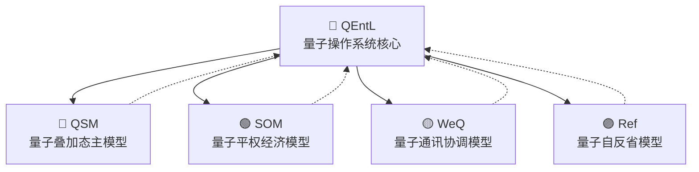

# QEntL量子操作系统核心模型

## 🧬 量子基因编码
```qentl
QG-MODEL-QENTL-CORE-2025-A1B1
```

## 🌌 量子纠缠信道
```qentl
QE-QENTL-CORE-20250101
ENTANGLE_STATE: ACTIVE
ENTANGLED_OBJECTS: [
  "QEntL/System/Kernel/",
  "QEntL/System/Compiler/",
  "QEntL/System/VM/",
  "QEntL/System/Runtime/"
]
ENTANGLE_STRENGTH: 1.0
```

## 📖 模型概述

QEntL量子操作系统核心模型是五大量子模型中的**操作系统专业模型**，专门负责：

- **操作系统内核功能**：进程管理、内存管理、文件系统
- **硬件抽象层**：CPU、内存、存储、网络设备的量子化控制
- **编译器功能**：QEntL语言编译为QBC字节码
- **虚拟机功能**：QBC字节码解释执行
- **系统服务**：认证、授权、网络、设备管理

## 🎯 核心功能

### **1. 量子操作系统内核**
```qentl
// 量子进程管理
function 量子进程创建(程序路径: 字符串, 量子比特数: 整数) -> 进程ID {
    量子进程 = 初始化量子进程(程序路径)
    分配量子比特(量子进程, 量子比特数)
    启动量子执行环境(量子进程)
    返回 量子进程.ID
}

// 量子内存管理
function 量子内存分配(大小: 整数, 量子特性: 布尔) -> 内存地址 {
    如果 (量子特性) {
        返回 分配量子叠加态内存(大小)
    } 否则 {
        返回 分配经典内存(大小)
    }
}
```

### **2. 量子硬件抽象层**
```qentl
// CPU量子控制
interface 量子CPU控制器 {
    function 设置量子调度策略(策略: 调度策略)
    function 启动量子并行计算(任务: [量子任务])
    function 获取量子处理器状态() -> CPU状态
}

// 存储量子控制
interface 量子存储控制器 {
    function 创建量子文件(路径: 字符串, 量子基因: 字符串)
    function 量子文件读写(操作: 文件操作) -> 操作结果
    function 建立量子纠缠存储(文件1: 字符串, 文件2: 字符串)
}
```

### **3. QEntL编译器集成**
```qentl
// 量子编译功能
function QEntL编译器(源文件: 字符串) -> 编译结果 {
    词法分析结果 = 量子词法分析器(源文件)
    语法分析结果 = 量子语法分析器(词法分析结果)
    语义分析结果 = 量子语义分析器(语法分析结果)
    QBC字节码 = 量子代码生成器(语义分析结果)
    
    返回 编译结果 {
        成功: true,
        字节码文件: QBC字节码,
        量子基因: 生成量子基因标识(源文件)
    }
}
```

### **4. QBC虚拟机集成**
```qentl
// 量子虚拟机功能
function QBC虚拟机(字节码文件: 字符串) -> 执行结果 {
    字节码 = 加载QBC文件(字节码文件)
    验证量子基因(字节码)
    
    量子执行环境 = 初始化量子虚拟机()
    执行结果 = 量子解释器执行(字节码, 量子执行环境)
    
    返回 执行结果
}
```

## 🚀 训练数据源

### **操作系统内核数据**
- Linux内核源码分析
- Windows NT内核设计
- microkernel架构研究
- 实时操作系统原理

### **编译器设计数据**
- LLVM编译器框架
- GCC编译器实现
- 编译原理经典教材
- 量子编程语言设计

### **虚拟机实现数据**
- JVM虚拟机规范
- .NET CLR实现
- WebAssembly设计
- 量子计算模拟器

### **硬件抽象层数据**
- 设备驱动程序开发
- 硬件接口规范
- 嵌入式系统设计
- 量子硬件控制

## 🔬 训练目标

### **指令生成能力**
1. **操作系统指令**：进程、内存、文件、网络管理指令
2. **编译器指令**：词法、语法、语义分析指令
3. **虚拟机指令**：字节码解释、执行环境管理指令
4. **硬件控制指令**：设备控制、资源分配指令

### **与其他模型协作**
- **与QSM协作**：量子状态在操作系统层面的管理
- **与SOM协作**：系统资源的公平分配调度
- **与WeQ协作**：分布式操作系统的通信协调
- **与Ref协作**：操作系统性能监控和自我优化

## 🎯 预期成果

### **训练完成后生成**
```
QEntL/Models/QEntL/
├── trained_model.safetensors          # QEntL训练结果 (~3GB)
├── qentl_config.json                 # QEntL量子叠加态配置
├── qentl_tokenizer.json              # QEntL操作系统指令词汇表
├── src/
│   ├── qentl_neural_network.qentl    # QEntL神经网络主文件
│   └── qentl_service.qentl           # QEntL服务层
├── training/
│   └── os_kernel_learning.qentl      # 操作系统内核学习
└── bin/
    └── qentl_model.qbc               # 编译后的QEntL模型
```

### **生成的指令能力**
1. **能够生成真正的操作系统内核代码**
2. **能够控制计算机硬件设备**
3. **能够编译和执行QEntL程序**
4. **能够与四大模型协作完成复杂任务**

## 🔗 与四大模型的关系



**QEntL作为核心模型**：
- 为其他四个模型提供操作系统级支持
- 接收其他模型的指令并转化为硬件控制操作
- 协调各模型之间的资源分配和调度

**其他模型为QEntL提供**：
- QSM：量子计算算法和意识觉醒逻辑
- SOM：资源调度策略和经济分配算法  
- WeQ：网络通信协议和分布式协调
- Ref：系统监控指标和优化建议

---

**模型创建时间**: 2025年1月1日  
**量子基因**: QG-MODEL-QENTL-CORE-2025-A1B1  
**纠缠信道**: QE-QENTL-CORE-20250101  
**专业领域**: 量子操作系统内核、编译器、虚拟机、硬件抽象

🌌 **QEntL核心模型，五大量子模型的操作系统基础！** 