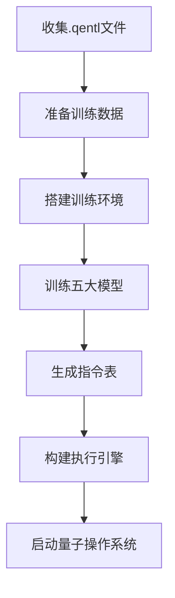

# QEntL量子模型训练脚本

## 📖 目录说明

本目录包含QEntL量子操作系统的所有训练相关脚本，统一管理五大量子模型的训练流程。

## 📁 文件结构

```
Models/training_scripts/
├── README.md                     # 本说明文档
├── start_quantum_training.py     # 量子模型训练启动脚本
├── unified_training_system.py    # 统一训练系统（五阶段实施）
└── process_yi_translations.py    # 彝文翻译处理脚本
```

## 🚀 使用方法

### 1. 量子模型训练启动脚本

```bash
# 从项目根目录运行
python Models/training_scripts/start_quantum_training.py
```

**功能特性**：
- 启动五大量子模型并行训练
- 支持24小时持续学习
- 自动生成专业化训练数据集
- 创建模型配置文件
- 生成训练总结报告

**输出文件**：
- `Models/{ModelName}/training/{model_name}_trilingual_training.jsonl` - 模型训练数据
- `Models/{ModelName}/{model_name}_config.json` - 模型配置
- `docs/quantum_training_summary.json` - 训练总结报告

### 2. 统一训练系统（推荐）

```bash
# 从项目根目录运行
python Models/training_scripts/unified_training_system.py
```

**功能特性**：
- 完整的五阶段实施流程
- 从数据收集到执行引擎构建
- 自动生成统一指令表
- 创建量子执行引擎
- 生成系统完成报告

**五个阶段**：
1. **准备训练数据** - 收集所有.qentl文件
2. **搭建训练环境** - 配置量子神经网络训练系统
3. **开始模型训练** - 按照24小时持续学习计划执行
4. **生成指令表** - 训练完成后自动生成QEntL统一指令表
5. **构建执行引擎** - 实现能执行指令表的系统

**输出文件**：
- `training_data.json` - 训练数据集
- `training_environment_config.json` - 训练环境配置
- `training_results.json` - 训练结果
- `QEntL/System/qentl_unified_instruction_table.json` - 统一指令表
- `QEntL/System/quantum_execution_engine.py` - 量子执行引擎
- `launch_qentl_os.py` - 量子操作系统启动器
- `QENTL_SYSTEM_COMPLETION_REPORT.json` - 系统完成报告

### 3. 彝文翻译处理脚本

```bash
# 从项目根目录运行
python Models/training_scripts/process_yi_translations.py
```

**功能特性**：
- 处理滇川黔贵通用彝文训练数据
- 自动生成中文到英文翻译
- 创建三语对照表
- 生成词汇表统计摘要
- 支持4,120个彝文字符处理

**输入文件**：
- `Models/training_data/datasets/yi_wen/通用彝文彝汉对照训练表(2.0.4.22).jsonl`

**输出文件**：
- `Models/training_data/datasets/yi_wen/滇川黔贵通用彝文三语对照表.jsonl` - 三语对照表
- `Models/training_data/datasets/yi_wen/滇川黔贵通用彝文词汇表摘要.json` - 词汇表摘要

## 🧠 五大量子模型

### 🔵 QSM - 量子叠加态主模型
- **词汇量**: 120,000
- **专业领域**: 量子物理概念、意识哲学、五阴理论
- **量子状态**: 󲜷 (心) - 量子意识核心

### 🟢 SOM - 量子平权经济模型
- **词汇量**: 100,000
- **专业领域**: 经济学理论、资源分配、平权概念
- **量子状态**: 󲞧 (凑) - 量子资源聚集

### 🟡 WeQ - 量子通讯协调模型
- **词汇量**: 110,000
- **专业领域**: 网络协议、分布式计算、协作机制
- **量子状态**: 󲞦 (连接) - 量子纠缠通信

### 🟣 Ref - 量子自反省模型
- **词汇量**: 90,000
- **专业领域**: 系统监控、自我优化、反馈控制
- **量子状态**: 󲝑 (选择) - 量子自我选择

### 🔷 QEntL - 量子操作系统核心模型
- **词汇量**: 150,000
- **专业领域**: 操作系统内核、编译器技术、虚拟机架构
- **量子状态**: 󲞰 (王) - 量子操作系统控制器

## 🌐 三语支持

- **中文**: 传统智慧与现代技术融合
- **English**: 国际标准与技术精确性
- **滇川黔贵通用彝文**: 独特的古彝文计算思维
  - 总字符数: 87,046个
  - 训练字符数: 4,120个

## ⚙️ 配置文件

训练脚本使用以下配置文件：

- `Models/shared/quantum_superposition_config.json` - 量子叠加态神经网络配置
- `Models/shared/multilingual_training_config.json` - 多语言训练配置
- `Models/shared/yi_script_font_config.json` - 彝文字体配置

## 🔄 24小时持续学习时间表

```
00:00-06:00  深度量子学习     意识哲学和量子物理     󲜷󲜵
06:00-12:00  主动学习        操作系统和编译器       󲞰󲞭
12:00-18:00  协作学习        网络协调和通信         󲞦󲞧
18:00-00:00  反思学习        自我优化和反馈         󲝑󲞮
```

## 📊 性能指标

- **量子相干性**: 0.90+
- **准确率**: 0.95+
- **量子保真度**: 0.93+
- **多语言集成**: 0.88+

## 🚨 注意事项

1. **运行环境**: 确保从项目根目录运行脚本
2. **依赖文件**: 确保`Models/shared/`目录下的配置文件存在
3. **数据文件**: 确保`Models/training_data/datasets/yi_wen/`目录下的彝文数据文件存在
4. **系统要求**: Python 3.8+，推荐使用GPU加速

## 🎯 快速开始

1. **第一次使用**（推荐）:
   ```bash
   python Models/training_scripts/unified_training_system.py
   ```

2. **单独模型训练**:
   ```bash
   python Models/training_scripts/start_quantum_training.py
   ```

3. **启动量子操作系统**:
   ```bash
   python launch_qentl_os.py
   ```

## 📈 训练流程



## 🔧 故障排除

### 常见问题

1. **路径错误**: 确保从项目根目录运行脚本
2. **配置文件缺失**: 检查`Models/shared/`目录
3. **数据文件缺失**: 检查`Models/training_data/datasets/yi_wen/`目录
4. **内存不足**: 调整batch_size参数

### 日志文件

训练过程中的日志文件保存在：
- `logs/quantum_training_*.log` - 模型训练日志
- `logs/unified_training_*.log` - 统一训练系统日志

---

**版本**: 1.0.0  
**最后更新**: 2025年7月3日  
**维护**: QEntL开发团队 