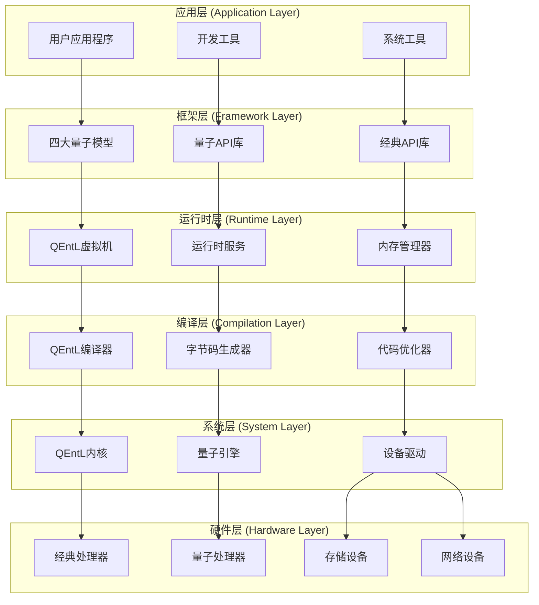
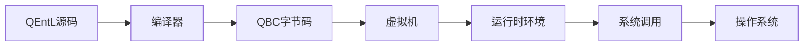
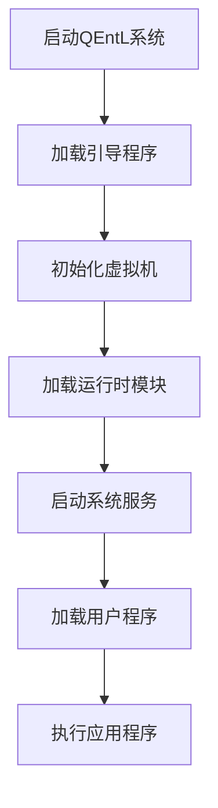
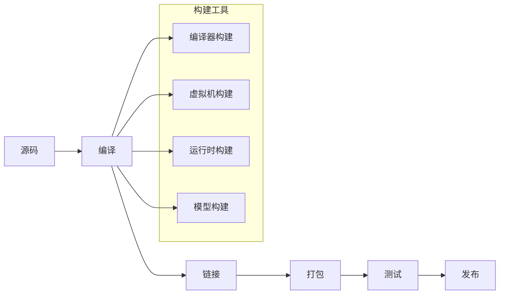
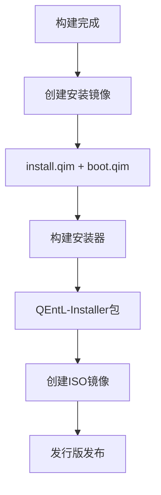

# QEntL 操作系统架构概览

## 🌟 系统简介

QEntL（Quantum Enhanced Language）是一个革命性的量子增强操作系统，融合了经典计算和量子计算的能力，为下一代计算应用提供统一的开发和运行环境。

## 🏗️ 总体架构



## 🎯 核心组件

### 1. 🔧 QEntL编译器 (Compiler)
**路径**: `QEntL\System\Compiler\`

- **功能**: 将QEntL源代码编译为QBC字节码
- **特性**: 支持量子语法、经典语法、类型检查
- **输出**: .qbc字节码文件
- **文档**: [编译器设计文档](components/compiler/COMPILER_DESIGN.md)

```
编译器组件:
├── 词法分析器 (Lexer)
├── 语法分析器 (Parser)  
├── 语义分析器 (Semantic Analyzer)
├── 量子优化器 (Quantum Optimizer)
└── 代码生成器 (Code Generator)
```

### 2. 🖥️ QEntL虚拟机 (Virtual Machine)
**路径**: `QEntL\System\VM\`

- **功能**: 执行QBC字节码，提供运行时环境
- **特性**: 量子态模拟、内存管理、垃圾回收
- **核心**: qentlvm.exe
- **文档**: [虚拟机规格文档](components/virtual-machine/VM_SPECIFICATION.md)

```
虚拟机组件:
├── 指令解释器 (Instruction Interpreter)
├── 字节码加载器 (Bytecode Loader)
├── 内存管理器 (Memory Manager)
├── 量子引擎 (Quantum Engine)
└── 调试接口 (Debug Interface)
```

### 3. ⚡ 运行时环境 (Runtime)
**路径**: `QEntL\System\Runtime\` + `QEntL\System\qbc\runtime\`

- **功能**: 提供系统服务和核心库
- **特性**: 模块化设计、字节码库
- **结构**: 按功能分类的.qbc模块
- **文档**: [运行时规格文档](components/runtime/RUNTIME_SPECIFICATION.md)

```
运行时模块:
├── core/      # 核心模块 (内核加载、引导)
├── memory/    # 内存管理 (分配、GC)
├── quantum/   # 量子计算 (量子引擎、量子态)
├── system/    # 系统服务 (进程、服务管理)
├── io/        # 输入输出 (文件系统、设备)
├── network/   # 网络模块 (协议栈、量子网络)
└── logging/   # 日志系统 (量子日志、调试)
```

### 4. 🌌 四大量子模型 (Quantum Models)
**路径**: `QEntL\Models\`

- **QSM**: 量子状态模型 (Quantum State Model)
- **WeQ**: 微量子模型 (Weak Quantum Model)  
- **SOM**: 同步组织模型 (Synchronous Organization Model)
- **Ref**: 引用模型 (Reference Model)

```
量子模型特性:
├── 量子态表示和操作
├── 量子算法实现
├── 量子错误纠正
└── 量子-经典接口
```

## 🔄 数据流

### 开发流程


### 执行流程


## 📂 目录架构

### 开发环境结构
```
F:\QSM\                          # 项目根目录
├── 📄 PROJECT_MASTER_GUIDE.md   # 项目主指南
├── 📁 QEntL/                   # 系统开发目录
│   ├── System/                 # 系统组件
│   │   ├── Compiler/          # 编译器
│   │   ├── VM/                # 虚拟机
│   │   ├── Runtime/           # 运行时源码
│   │   ├── qbc/               # 字节码输出
│   │   └── Kernel/            # 系统内核
│   ├── Models/                # 四大模型
│   ├── Programs/              # 应用程序
│   ├── Users/                 # 用户环境
│   └── docs/                  # 系统文档
├── 📁 QEntL-Build/            # 构建系统
├── 📁 QEntL-Installer/        # 安装器
├── 📁 QEntL-Distribution/     # 发行版
└── 📁 docs/                   # 项目文档中心
```

### 运行时结构
```
QEntL\System\qbc\               # 字节码目录
├── runtime/                   # 运行时字节码
│   ├── core/                 # 核心模块
│   ├── memory/               # 内存管理
│   ├── quantum/              # 量子计算
│   ├── system/               # 系统服务
│   ├── io/                   # 输入输出
│   ├── network/              # 网络
│   └── logging/              # 日志
├── kernel/                   # 内核字节码
├── system/                   # 系统字节码
└── tests/                    # 测试字节码
```

## 🔧 构建管道

### 构建阶段


### 发布流程


## 🎯 技术特性

### 量子计算支持
- **量子位模拟**: 最多64量子位经典模拟
- **量子门操作**: 完整量子门集合
- **量子算法**: 内置量子算法库
- **量子纠错**: 量子错误纠正码

### 经典计算兼容
- **现代语法**: 类似C++/Rust的语法设计
- **内存安全**: 自动内存管理和垃圾回收
- **并发编程**: 协程、异步、并行支持
- **跨平台**: Windows、Linux支持

### 系统集成
- **统一虚拟机**: 量子-经典混合执行
- **模块化设计**: 可插拔组件架构
- **标准化接口**: 统一的API和ABI
- **开发工具**: 完整的开发工具链

## 📊 开发状态

### 🟢 已完成 (60%)
- [x] 项目架构设计
- [x] 目录结构标准化
- [x] 运行时模块编译
- [x] 字节码生成系统
- [x] 用户环境模板
- [x] 安装器框架
- [x] 文档体系

### 🟡 进行中 (30%)
- [ ] 编译器完整实现
- [ ] 虚拟机核心功能
- [ ] 量子引擎开发
- [ ] 四大模型集成
- [ ] 系统内核实现

### 🔴 待开始 (10%)
- [ ] 图形用户界面
- [ ] 网络协议栈
- [ ] 设备驱动框架
- [ ] 应用程序生态
- [ ] 性能优化

## 🎯 里程碑计划

### 里程碑 1: 核心系统 (当前)
- 完成编译器和虚拟机核心功能
- 实现基础运行时环境
- 建立构建和测试系统

### 里程碑 2: 量子集成
- 集成四大量子模型
- 实现量子-经典混合计算
- 开发量子调试工具

### 里程碑 3: 系统完善
- 完成系统内核和驱动
- 实现图形界面系统
- 建立应用程序框架

### 里程碑 4: 生态建设
- 发布开发者工具
- 建立社区和文档
- 推广和应用部署

## 📞 相关资源

### 文档链接
- [构建系统指南](build/BUILD_SYSTEM_GUIDE.md)
- [虚拟机规格](components/virtual-machine/VM_SPECIFICATION.md)
- [编译器设计](components/compiler/COMPILER_DESIGN.md)
- [安装器规格](components/installer/INSTALLER_SPECIFICATION.md)

### 外部资源
- **量子计算**: IBM Qiskit, Google Cirq
- **编译器技术**: LLVM, GCC
- **虚拟机技术**: JVM, .NET CLR
- **操作系统**: Linux Kernel, Windows NT

---
**文档版本**: 1.0.0  
**最后更新**: 2025年6月19日  
**项目状态**: 开发中 (Alpha)  
**维护者**: QEntL架构团队
