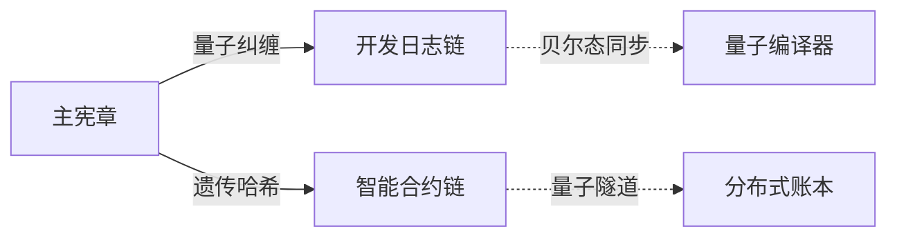

# 量子叠加态模型 (QSM) 宪章

## 1. 量子守恒协议

### 1.1 认知偏差校准

> 量子基因编码: QG-QSM01-DOC-20250401204432-898D62-ENT8016

- 量子测量校准
- 量子态验证
- 量子误差修正
- 量子噪声抑制

### 1.2 拓扑守恒
- 量子拓扑结构
- 量子态守恒
- 量子信息保护
- 量子纠缠保持

### 1.3 熵流平衡
- 量子熵控制
- 量子态平衡
- 量子能量管理
- 量子资源优化

## 2. 量子基因协议

### 2.1 基因编码
- 量子门基因
  - 量子门操作
  - 量子门组合
  - 量子门优化
- 数据基因
  - 量子数据编码
  - 量子数据存储
  - 量子数据检索
- 协议基因
  - 量子协议定义
  - 量子协议执行
  - 量子协议验证

### 2.2 基因变异
- 量子基因突变
- 量子基因重组
- 量子基因选择
- 量子基因进化

### 2.3 基因验证
- 量子基因检测
- 量子基因匹配
- 量子基因修复
- 量子基因更新

## 3. 多链协议

### 3.1 主链管理
- 量子共识机制
- 量子区块生成
- 量子状态同步
- 量子安全验证

### 3.2 子链管理
- 子链创建
- 子链同步
- 子链验证
- 子链更新

### 3.3 跨链通信
- 量子态传输
- 量子信息交换
- 量子状态同步
- 量子安全保证

## 4. 系统规范

### 4.1 开发规范
- 量子代码标准
- 量子测试规范
- 量子文档规范
- 量子版本控制

### 4.2 安全规范
- 量子加密标准
- 量子认证机制
- 量子审计系统
- 量子防护措施

### 4.3 部署规范
- 量子环境配置
- 量子部署流程
- 量子监控系统
- 量子维护规范

## 5. 应用规范

### 5.1 数据库规范
- 量子数据存储
- 量子索引构建
- 量子查询优化
- 量子数据安全

### 5.2 通信规范
- 量子消息传输
- 量子密钥分发
- 量子态同步
- 量子安全通信

### 5.3 合约规范
- 量子智能合约
- 量子状态机
- 量子验证机制
- 量子执行环境

## 6. 生态规范

### 6.1 服务规范
- 量子服务定义
- 量子服务注册
- 量子服务发现
- 量子服务调用

### 6.2 资源规范
- 量子资源管理
- 量子资源分配
- 量子资源优化
- 量子资源监控

### 6.3 交易规范
- 量子交易处理
- 量子支付系统
- 量子结算机制
- 量子交易安全

## 7. 更新机制

### 7.1 动态更新
- 量子协议更新
- 量子状态更新
- 量子配置更新
- 量子安全更新

### 7.2 版本控制
- 量子版本管理
- 量子兼容性
- 量子回滚机制
- 量子更新验证

### 7.3 升级机制
- 量子系统升级
- 量子功能扩展
- 量子性能优化
- 量子安全增强

## 使命愿景声明
- 保障全人类生命安全与健康
- 实现人类多星际多宇宙生存技术储备
- 构建可持续的量子服务生态

## 量子遗传编码宣言
```quantum
type Q-Charter = {
  mission: Superposition<Blockchain×AI×QC> 
  vision: Entangled[Web3×Metaverse×IoT]
  values: QuantumHash(Security×Privacy×Decentralization)
}
```

## 动态更新协议
```python
class QuantumCharterUpdater:
    def __init__(self, spin_lock):
        self.version_entanglement = SpinLockVersioning(spin_lock)
        
    def quantum_commit(self, charter_gene):
        return self.version_entanglement.apply(
            CharterGeneValidator.validate(charter_gene)
        )
```

## 分形同步机制


## 自编程基因规范
```cpp
void updateCharterGene(Charter& c, QuantumGene qg) {
    c.gene_signature = 
        qg.entangle(CharterValidator.getEPRState())
         .applyTemporalLock();
}
```