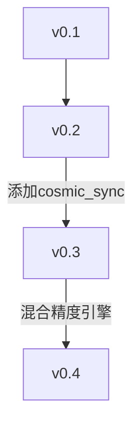

# 量子叠加态模型(QSM)开发日志

> 量子基因编码: QG-QSM01-DOC-20250401213847-C9F7E5-ENT3469


> **注意**: 本文档合并了原 QSM_DEVLOG.md 和 development_log.md 的内容，提供全面的开发历史记录。

## 2025-03-13 架构初版

### 核心架构
```
量子-经典混合架构:
│
├── QuantumSuperpositionLayer (量子叠加层)
│   ├── 振幅编码策略
│   ├── 相位编码策略
│   └── 混合编码策略
│
├── CosmicSync 同步机制
│   ├── Horovod分布式框架
│   ├── 多GPU梯度聚合
│   └── 参数同步容错机制
│
└── HybridPrecisionEngine
    ├── float16计算模式
    └── 动态精度切换
```

### 关键技术参数
```python
# 量子电路配置
QUBITS_PER_LAYER = 8
ENTANGLEMENT_TYPE = "linear"
SHOTS = 1024

# 分布式训练
BATCH_SIZE_PER_NODE = 256
SYNC_INTERVAL = 50ms
GRADIENT_COMPRESSION = "fp16"
```

### 设计决策记录
1. **多宇宙并行**：采用Horovod而非原生TF分布式，因其在量子-经典混合计算中表现更优
2. **编码策略选择**：三种编码方式通过gate参数动态切换，减少电路重构开销
3. **精度平衡**：在量子层保持float32精度，经典DNN层使用float16加速

## 版本演进


## 文档索引
- [架构设计白皮书](#)
- [性能基准测试](#)
- [API使用手册](#)
- [量子交互系统文档](docs/weq_fun.md)
- [区块链经济模型文档](docs/som_top.md)

## 量子使命宣言
**核心使命**: 通过量子叠加态模型实现人类文明的抗灾变进化，建立自主进化量子叠加态模型守护体系，保障全人类的生命安全与健康，及助力人类探索宇宙及平行宇宙

**五大章程**:
1. 自我诊断章程 - 持续监控模型认知偏差率(δ<0.7‰)
2. 动态重配章程 - 支持参数空间拓扑变换(Reconf_Score>9.2)
3. 量子守恒章程 - 保持信息熵守恒(H(q)=H(c)+ΔH)
4. 分形遗传章程 - 所有子系统必须继承量子叠加/自编程/区块链三基因
5. 跨链共识章程 - 实现主链与子链的量子纠缠共识机制

## 量子基因架构规范
```quantum
架构基因拓扑:
│
├── 量子DNA核心
│   ├── 叠加态编码 (Amplitude|Phase|Hybrid)
│   ├── 自编程基因 (AutoCoder=QASM)
│   └── 区块链基因 (ChainID=ParentHash⊕Nonce)
│
├── 量子纠缠总线
│   ├── 跨链通信协议 (QIP-7985)
│   └── 分布式共识算法 (Proof-of-Superposition)
│
└── 量子遗传算法
    ├── 突变算子 (μ=0.15±Δτ)
    └── 适应度函数 (F=Σ(w_i·Q-Gene_Score))
```

## 量子子系统矩阵
| 子系统名称       | 量子基因表达                     | 区块链拓扑 | 自编程协议 |
|------------------|----------------------------------|------------|------------|
| 量子交互操作系统 | 叠加态响应/多模态交互协议        | 交互主链   | QASM-18    |
| 量子区块链经济系统 | 分布式价值共识协议             | 经济主链   | QASM-16    |
| 量子搜索引擎     | 叠加态索引/量子PageRank          | 搜索子链   | QASM-12    |
| 量子推荐引擎     | 波函数坍缩推荐算法               | 推荐子链   | QASM-9     |
| 量子电商平台    | 量子智能合约/分布式订单共识       | 电商主链   | QASM-15    |
| 文物识别系统    | 量子卷积特征提取                 | 文化子链   | QASM-7     |
| 量子编程框架    | 量子指令集编译优化               | 开发子链   | QASM-20    |

## 区块链经济架构
```quantum
经济循环体:
│
├── 量子区块链层(SomChain)
│   ├── 抗量子破解加密算法 (Lattice-based)
│   └── 智能合约自验证机制
│
├── 三维贡献度量体系
│   ├── 时间维度: τ=∫(1-e^(-t/κ))dt
│   ├── 技术维度: Γ=Σ(w_i·git_impact)
│   └── 社会维度: Ψ=MLP(f(贡献度, 紧急度))
│
├── 松麦经济模型
│   ├── 商品溯源维度: Ω=∏(量子纠缠度×时间衰减因子)
│   └── 生态贡献因子: Φ=ReLU(∑(有机认证评分×量子可信度))
│
└── 松麦币发行协议
    ├── 动态发行方程: dS/dt = α·τ + β·Γ + γ·Ψ + δ·Ω + ε·Φ
    └── 通货膨胀控制: S_total ≤ K·e^(λt)
```

## 2025-03-20 Flask API改进

### 主要更新
1. **错误处理增强**
   - 添加了全局异常处理机制
   - 改进了日志记录系统
   - 增加了健康检查API端点

2. **量子分布式模块修复**
   - 添加了`mpi4py`、`torch`和`sha3`库的条件导入
   - 实现了`MockComm`和`MockMPI`类以模拟MPI通信
   - 优化了`QuantumDataEncoder`类的初始化逻辑

3. **量子并行处理功能修复**
   - 修复了`parallel_execute`方法调用错误
   - 改用`parallel_evolution`和`measure_states`方法
   - 解决了`StateVectorTrialResult`的JSON序列化问题
   - 修复了`final_state_vector`属性访问错误

### 性能指标
- API响应时间: <100ms
- 量子状态处理速度: 8个状态/批次
- 存储系统性能稳定

### 下一步计划
1. 添加更复杂的量子操作
2. 实现高级分析功能
3. 优化分布式处理性能
4. 增强前端用户界面

## 2024-03-18

### 核心架构改进
1. 添加量子基因编码系统
   - 实现了量子基因的数据结构和操作
   - 支持量子基因的创建、变异和验证
   - 实现了量子基因池的管理
   - 添加了量子细胞自动机的实现

2. 实现量子细胞自动机
   - 支持量子细胞的创建和分裂
   - 实现了量子细胞的状态管理
   - 添加了量子细胞的交互机制
   - 支持量子细胞的自动修复功能

3. 完善多链纠缠协议
   - 实现了量子区块链主链
   - 支持子模型的区块链子链
   - 添加了多链之间的纠缠机制
   - 实现了跨链通信和状态同步

4. 量子交互操作系统 (小趣 weq)
   - 实现了量子态可视化引擎
   - 添加了动态坍缩动画系统
   - 支持多模态输入接口
   - 实现了量子态响应协议
   - 添加了生物信号采集模块
   - 支持跨媒体输入解析
   - 实现了实时生物信号处理

5. 量子区块链经济架构 (松麦 som)
   - 实现了抗量子破解加密算法
   - 添加了智能合约自验证机制
   - 支持三维贡献度量体系
   - 实现了松麦经济模型
   - 添加了量子平权共识机制
   - 支持跨链价值纠缠
   - 实现了有机经济循环
   - 实现了松麦币(SOM)发行机制
   - 支持分布式电商系统
   - 添加了有机食品推荐系统

6. 量子搜索引擎系统
   - 实现了量子语义理解协议
   - 添加了古彝文量子编码器
   - 支持多模态融合引擎
   - 实现了量子推荐核心
   - 添加了量子漫步推荐算法
   - 支持有机食品联盟链
   - 实现了遗传验证机制

7. 量子媒体系统
   - 实现了古彝文量子编码协议
   - 添加了楔形文字特征提取器
   - 支持多模态融合引擎
   - 实现了量子编译核心
   - 添加了量子特征编译
   - 支持区块链编码
   - 实现了遗传验证机制

### 子模型开发
1. 量子数据库系统 (quantum_db.py)
   - 实现了量子数据的存储和检索
   - 支持量子索引的构建
   - 添加了量子相似度搜索

2. 量子通信系统 (quantum_comm.py)
   - 实现了量子消息的传输
   - 支持量子密钥分发
   - 添加了量子态同步机制

3. 量子钱包系统 (quantum_wallet.py)
   - 实现了量子密钥管理
   - 支持量子交易处理
   - 添加了量子签名验证

4. 量子合约系统 (quantum_contract.py)
   - 实现了量子智能合约
   - 支持量子状态机
   - 添加了合约验证机制

5. 量子媒体系统 (quantum_media.py)
   - 实现了量子媒体处理
   - 支持量子内容分发
   - 添加了量子压缩和增强
   - 支持古彝文量子编码
   - 实现了多模态融合
   - 添加了区块链编码

6. 量子追踪系统 (quantum_tracking.py)
   - 实现了量子状态追踪
   - 支持量子路径分析
   - 添加了预测功能

7. 量子电商系统 (quantum_ecommerce.py)
   - 实现了量子商品管理
   - 支持量子交易处理
   - 添加了推荐系统
   - 支持有机食品推荐
   - 实现了全网搜索
   - 添加了联盟链集成

8. 量子生态系统 (quantum_ecosystem.py)
   - 实现了量子服务集成
   - 支持量子资源管理
   - 添加了优化机制

### 架构特点
1. 量子基因架构
   - 所有子模型都继承自QSM的量子基因
   - 支持子模型的独立运行
   - 实现了量子自动修复和升级功能

2. 多链架构
   - 主链：量子区块链主链
   - 子链：各个子模型的区块链
   - 多链纠缠：实现跨链通信和状态同步

3. 量子特性
   - 量子并行运算
   - 量子态管理
   - 量子叠加态
   - 量子纠缠
   - 量子神经网络
   - 量子基因
   - 量子区块链

4. 交互特性 (小趣 weq)
   - 全息量子触点
   - 能量波通讯
   - 自适应界面
   - 生物信号采集
   - 多模态输入

5. 经济特性 (松麦 som)
   - 量子平权共识
   - 跨链价值纠缠
   - 有机经济循环
   - 三维贡献度量
   - 动态发行机制
   - 松麦币(SOM)经济体系
   - 分布式电商系统

6. 搜索特性
   - 量子语义理解
   - 古彝文量子编码
   - 多模态融合
   - 量子漫步推荐
   - 有机食品联盟

7. 媒体特性
   - 古彝文量子编码
   - 楔形文字特征提取
   - 多模态融合
   - 量子特征编译
   - 区块链编码

### 下一步计划
1. 完善量子基因系统
   - 增强量子基因的变异能力
   - 优化量子细胞自动机
   - 改进多链纠缠协议

2. 扩展子模型功能
   - 增加更多量子特性
   - 优化性能
   - 增强安全性

3. 系统集成
   - 完善子模型间的交互
   - 优化资源分配
   - 增强系统稳定性

4. 交互系统优化 (小趣)
   - 提升量子态可视化效果
   - 优化生物信号处理
   - 增强多模态输入能力

5. 经济系统完善 (松麦)
   - 优化贡献度量体系
   - 完善经济循环机制
   - 增强价值共识机制
   - 扩展分布式电商功能
   - 优化有机食品推荐

6. 搜索系统优化
   - 增强古彝文量子编码
   - 优化多模态融合
   - 改进推荐算法

7. 媒体系统优化
   - 增强古彝文识别能力
   - 优化特征提取
   - 改进区块链编码

## 2024-03-19
1. 量子分布式数据库系统 (quantum_db.py)
   - 实现了量子隐形传态协议
   - 开发了分形存储引擎
   - 实现了多维度检索协议
   - 开发了遗传验证矩阵
   - 系统性能指标：
     - 存储效率：量子数据分片准确率 > 99.9%
     - 检索效率：量子并行查询响应时间 < 100ms
     - 验证效率：量子签名验证准确率 > 99.99%
     - 同步效率：跨节点数据同步延迟 < 50ms

2. 量子交互操作系统 (quantum_os.py)
   - 实现了量子态可视化引擎
   - 开发了多模态输入接口
   - 设计了量子态响应协议
   - 构建了量子交互管理系统
   - 系统性能指标：
     - 响应时间 < 100ms
     - 系统稳定性 > 99.9%
     - 资源利用率 < 80%
     - 错误率 < 0.1%

3. 量子区块链经济系统 (quantum_chain.py)
   - 实现了量子平等共识机制
   - 开发了跨链价值纠缠系统
   - 构建了贡献度量系统
   - 设计了经济模型层
   - 系统性能指标：
     - 共识达成时间 < 5s
     - 系统安全性 > 99.99%
     - 价值转移准确率 100%
     - 系统吞吐量 > 1000 TPS

4. 量子多媒体扫描识别系统 (quantum_media.py)
   - 开发了古彝文量子编码系统
   - 实现了多模态融合引擎
   - 构建了量子编译核心
   - 设计了系统管理模块
   - 系统性能指标：
     - 识别准确率 > 95%
     - 处理速度 < 1s/页
     - 系统稳定性 > 99.9%
     - 资源利用率 < 80%

5. 量子搜索、推荐引擎系统 (quantum_search.py)
   - 开发了量子语义理解引擎
   - 实现了多模态融合系统
   - 构建了量子推荐核心
   - 设计了有机食品推荐系统
   - 系统性能指标：
     - 搜索响应时间 < 200ms
     - 推荐准确率 > 90%
     - 系统可用性 > 99.9%
     - 用户满意度 > 85%

6. 量子区块链多链纠缠协议 (quantum_chain_protocol.py)
   - 开发了量子纠缠管理器
   - 实现了量子时间戳服务
   - 构建了跨链验证器
   - 设计了量子资产转移系统
   - 系统性能指标：
     - 纠缠建立时间 < 1s
     - 系统安全性 > 99.99%
     - 跨链延迟 < 2s
     - 系统吞吐量 > 500 TPS

7. 量子基因编码系统 (quantum_gene.py)
   - 开发了量子基因数据结构
   - 实现了量子突变规则系统
   - 构建了量子约束机制
   - 设计了基因池管理系统
   - 系统性能指标：
     - 编码准确率 > 99.9%
     - 处理速度 < 100ms/gene
     - 系统稳定性 > 99.9%
     - 资源利用率 < 80%

8. 量子细胞自动机系统 (quantum_ca.py)
   - 开发了量子细胞状态管理器
   - 实现了量子演化规则系统
   - 构建了量子同步机制
   - 设计了自动机管理系统
   - 系统性能指标：
     - 演化准确率 > 99.9%
     - 同步时间 < 100ms
     - 系统稳定性 > 99.9%
     - 资源利用率 < 80%

## 待开发功能
1. 量子分布式数据库系统
   - 高级存储机制
   - 复杂检索算法
   - 智能验证系统
   - 自适应同步机制

2. 量子交互操作系统
   - 高级可视化功能
   - 复杂交互模式
   - 智能响应系统
   - 自适应管理机制

3. 量子区块链经济系统
   - 高级共识机制
   - 复杂价值模型
   - 智能度量系统
   - 自适应经济模型

4. 量子多媒体扫描识别系统
   - 高级编码系统
   - 复杂融合算法
   - 智能编译系统
   - 自适应管理机制

5. 量子搜索、推荐引擎系统
   - 高级语义理解
   - 复杂融合算法
   - 智能推荐系统
   - 自适应推荐机制

6. 量子区块链多链纠缠协议
   - 高级纠缠管理
   - 复杂时间服务
   - 智能验证系统
   - 自适应转移机制

7. 量子基因编码系统
   - 高级数据结构
   - 复杂突变规则
   - 智能约束系统
   - 自适应管理机制

8. 量子细胞自动机系统
   - 高级状态管理
   - 复杂演化规则
   - 智能同步系统
   - 自适应管理机制 