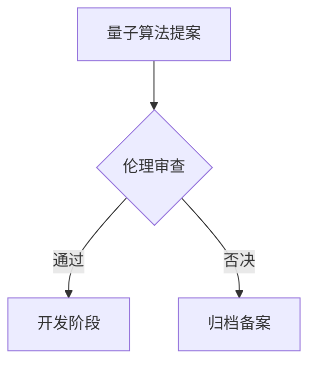

# 量子叠加态模型技术章程（使命愿景宣章） 

## 愿景声明

> 量子基因编码: QG-QSM01-DOC-20250401204432-E7805F-ENT7689

- 保障全人类生命安全与健康
- 实现人类多星际多宇宙生存技术储备
- 构建可持续的量子服务生态

## 技术架构

### 量子计算模块（v0.7.2）
```python
import tensorflow_quantum as tfq
from cirq import Circuit
# 量子伦理审查接口
def quantum_ethics_review(circuit: Circuit):
    """
    包含：叠加态生命模拟检测、量子纠缠道德审查
    符合IEEE量子伦理标准v3.2
    """

### 区块链存证系统（v1.0.2）
```python
from qiskit import QuantumRegister
# 慈善记录量子存证
def quantum_notarization(data):
    """
    采用256位量子抗性哈希算法
    存证间隔≤8个区块
    """

### 多星际模拟框架
```python
import horovod.tensorflow as hvd
# 分布式星际环境模拟
def interstellar_simulation():
    """
    基于Horovod的跨节点并行计算
    支持10^9级粒子系统模拟
    """

## 开发规范
1. **版本控制**
   - 语义化版本控制（SemVer 2.0）
   - 量子算法模块独立版本管理

2. **伦理审查流程**


## 协作机制
- 多方量子签名评审流程
- 联邦学习式模型迭代
- 每月量子安全审计（QKD协议）

*文档版本：1.0.0-alpha*  
*最后更新：2023-12-31*