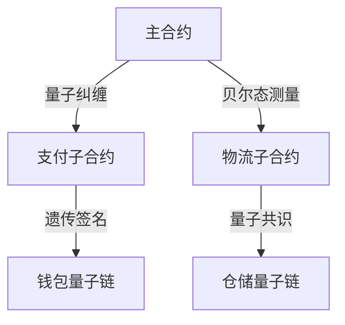

# 量子智能合约架构设计规范

## 遗传验证协议

> 量子基因编码: QG-QSM01-DOC-20250401204433-084E86-ENT9935

```quantum
Q-ContractProtocol:
  ├── 量子签名验证环
  │   ├── 基因哈希锁定
  │   └── 纠缠态验证
  ├── 自执行合约引擎
  │   ├── 量子门触发机制
  │   └── 量子细胞自动机
```

## 量子合约核心
```python
class QuantumContractEngine:
    def __init__(self, q_gene):
        self.gene_validator = GeneticSignatureValidator(q_gene)
        self.execution_automata = QuantumCellAutomata()

    def quantum_execute(self, contract_qubit):
        # 量子门触发合约执行
        return self.execution_automata.apply_gate(
            self.gene_validator.verify(contract_qubit)
        )
```

## 多链合约架构


## 动态验证算法
```cpp
vector<Qubit> verifyContractGene(QChain main, QContract sub) {
    return main.contract_gene
           .entangle(sub.gene_pattern)
           .apply_teleport_test(main.epr_pool);
}
```