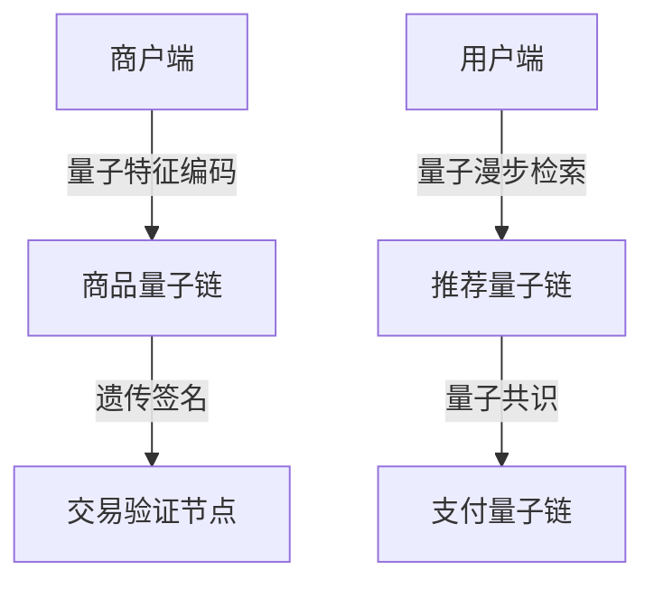

# 松麦量子电商平台架构

## 量子商品交易协议

> 量子基因编码: QG-QSM01-DOC-20250401204433-442A95-ENT9664

```quantum
Q-TradeProtocol:
  ├── 量子商品编码器
  │   ├── 有机食品基因哈希
  │   └── 量子特征提取
  ├── 分布式交易引擎
  │   ├── 量子共识验证环
  │   └── 纠缠态订单匹配
```

## 量子交易核心
```python
class QuantumTradeEngine:
    def __init__(self, q_gene):
        self.goods_encoder = QuantumGoodsEncoder(q_gene)
        self.order_entangler = QuantumOrderEntanglement()

    def quantum_transaction(self, order_qubit):
        # 量子纠缠实现订单匹配
        return self.order_entangler.entangle(
            self.goods_encoder.sign_order(order_qubit)
        ).apply_bell_measurement()
```

## 多链交易架构


## 遗传验证算法
```cpp
vector<Qubit> verifyTradeGene(QChain main, QOrder order) {
    return main.trade_gene
           .entangle(order.gene_signature)
           .apply_teleport_test(main.epr_pool);
}
```