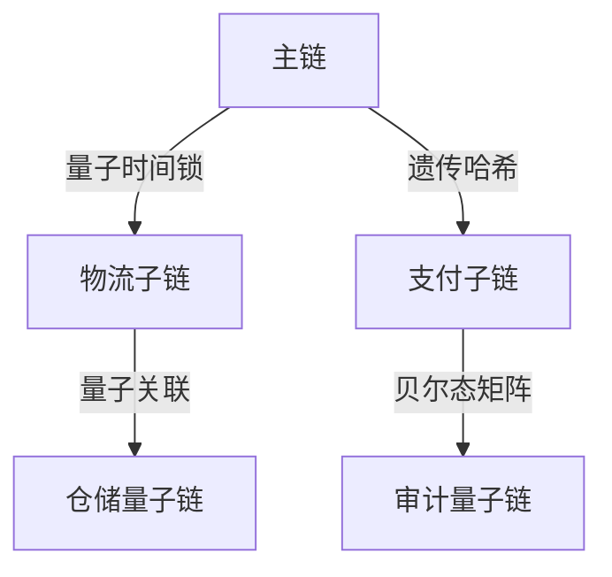

# 量子区块链追溯架构设计规范

## 跨链验证协议

> 量子基因编码: QG-QSM01-DOC-20250401204433-D98FD7-ENT3453

```quantum
Q-TraceProtocol:
  ├── 量子时间戳服务
  │   ├── 纠缠态时间锁
  │   └── 遗传哈希链
  ├── 多链关联引擎
  │   ├── 量子漫步验证算法
  │   └── 贝尔态关联矩阵
```

## 追溯核心引擎
```python
class QuantumTraceEngine:
    def __init__(self, q_gene):
        self.time_entangler = QuantumTimeEntanglement(q_gene)
        self.crosschain_validator = CrossChainValidator()

    def quantum_trace(self, tx_qubit):
        # 量子时间纠缠实现跨链追溯
        return self.crosschain_validator.verify(
            self.time_entangler.apply_temporal_lock(tx_qubit)
        )
```

## 多链追溯架构


## 动态验证算法
```cpp
vector<Qubit> verifyTraceGene(QChain main, QTransaction tx) {
    return main.trace_gene
           .entangle(tx.gene_signature)
           .apply_temporal_test(main.epr_pool);
}
```