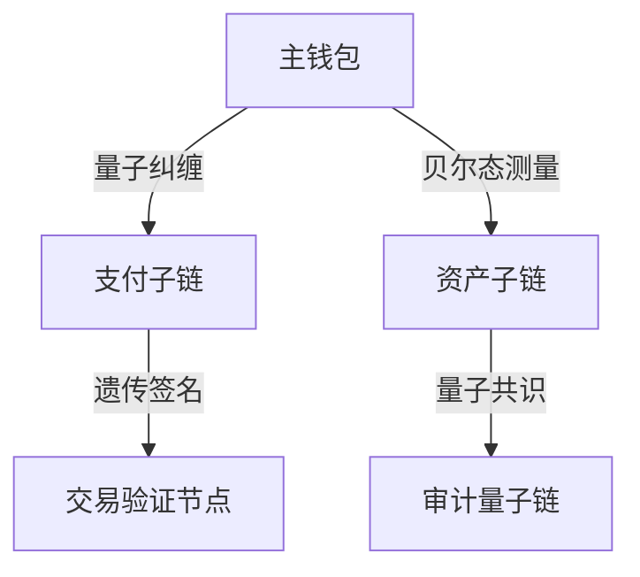

# 量子钱包架构设计规范

## 量子资产加密协议

> 量子基因编码: QG-QSM01-DOC-20250401204433-57893A-ENT7092

```quantum
Q-WalletProtocol:
  ├── 量子密钥生成器
  │   ├── 基因哈希密钥派生
  │   └── 量子随机数发生器
  ├── 资产转移验证环
  │   ├── 贝尔态签名验证
  │   └── 纠缠交换审计
```

## 量子钱包核心
```python
class QuantumWalletCore:
    def __init__(self, q_gene):
        self.key_deriver = QuantumKeyDeriver(q_gene)
        self.transaction_validator = EntanglementValidator()

    def quantum_transfer(self, asset_qubit):
        # 量子隐形传态实现资产转移
        return self.transaction_validator.verify(
            self.key_deriver.sign_transaction(asset_qubit)
        ).teleport()
```

## 多链钱包架构


## 遗传验证算法
```cpp
vector<Qubit> verifyWalletGene(QChain main, QWallet sub) {
    return main.wallet_gene
           .entangle(sub.gene_pattern)
           .apply_swap_test(main.epr_pairs);
}
```