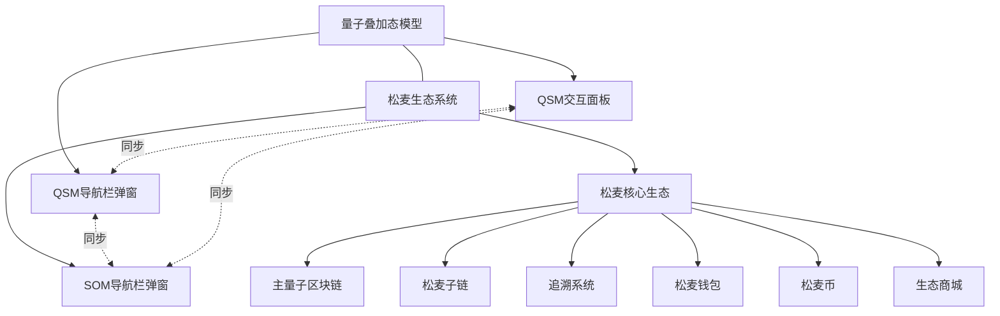

# 松麦与QSM系统集成方案

## 概述

> 量子基因编码: QG-QSM01-DOC-20250401204433-CDA750-ENT5005


松麦生态系统与量子叠加态模型(QSM)的集成设计，重点关注多模态交互功能的同步和共享，确保用户在不同系统间获得一致的体验。

## 系统关系图



## 多模态交互同步

### 同步架构

三处交互界面通过WebSocket实时同步状态：

1. QSM首页交互面板
2. QSM导航栏弹窗
3. 松麦系统导航栏弹窗

### 同步内容

以下内容在三处界面间保持实时同步：

- 面板打开/关闭状态
- 当前选择的交互模式
- 交互历史
- 用户设置与偏好

### 实现机制

**后端同步服务**：

```python
from channels.generic.websocket import AsyncWebsocketConsumer
import json

class SyncConsumer(AsyncWebsocketConsumer):
    async def connect(self):
        # 将连接加入到同步组
        await self.channel_layer.group_add('modal_sync', self.channel_name)
        await self.accept()

    async def disconnect(self, close_code):
        # 断开连接时离开同步组
        await self.channel_layer.group_discard('modal_sync', self.channel_name)

    async def receive(self, text_data):
        # 接收来自客户端的消息
        data = json.loads(text_data)
        
        # 广播到同步组的所有连接
        await self.channel_layer.group_send(
            'modal_sync',
            {
                'type': 'sync_message',
                'message': data
            }
        )

    async def sync_message(self, event):
        # 发送同步消息到客户端
        await self.send(text_data=json.dumps(event['message']))
```

**前端同步实现**：

```javascript
class ModalSyncManager {
    constructor(source) {
        this.source = source; // 'qsm_panel', 'qsm_nav', 'som_nav'
        this.ws = null;
        this.handlers = {
            'panel_state': [],
            'interaction_mode': [],
            'history_update': []
        };
        
        this.connect();
    }
    
    connect() {
        this.ws = new WebSocket(`ws://${window.location.host}/ws/modal_sync/`);
        
        this.ws.onopen = () => {
            console.log(`[${this.source}] 同步连接已建立`);
        };
        
        this.ws.onmessage = (event) => {
            const data = JSON.parse(event.data);
            
            // 忽略来自自己的消息
            if (data.source === this.source) return;
            
            // 调用对应类型的处理函数
            if (this.handlers[data.type]) {
                this.handlers[data.type].forEach(handler => handler(data));
            }
        };
        
        this.ws.onclose = () => {
            console.log(`[${this.source}] 同步连接已关闭，尝试重连...`);
            setTimeout(() => this.connect(), 3000);
        };
    }
    
    on(type, handler) {
        if (this.handlers[type]) {
            this.handlers[type].push(handler);
        }
        return this;
    }
    
    send(type, data) {
        if (this.ws && this.ws.readyState === WebSocket.OPEN) {
            this.ws.send(JSON.stringify({
                type,
                source: this.source,
                ...data
            }));
        }
    }
}
```

## 九种交互模式集成

九种多模态交互方式在松麦和QSM系统之间共享实现，保持一致的交互体验。

### 交互模式实现

1. **文本模式**

```javascript
// 在SOM和QSM系统中共享的文本交互实现
class TextInteractionHandler {
    constructor(container, apiEndpoint) {
        this.container = container;
        this.apiEndpoint = apiEndpoint;
        this.render();
        this.bindEvents();
    }
    
    render() {
        this.container.innerHTML = `
            <div class="text-interaction">
                <div class="text-interaction-responses"></div>
                <div class="text-interaction-input-area">
                    <textarea class="text-interaction-input" 
                              placeholder="输入文本..."></textarea>
                    <button class="text-interaction-send">发送</button>
                </div>
            </div>
        `;
    }
    
    bindEvents() {
        const input = this.container.querySelector('.text-interaction-input');
        const sendBtn = this.container.querySelector('.text-interaction-send');
        
        sendBtn.addEventListener('click', () => this.sendMessage(input.value));
        input.addEventListener('keypress', (e) => {
            if (e.key === 'Enter' && !e.shiftKey) {
                e.preventDefault();
                this.sendMessage(input.value);
            }
        });
    }
    
    sendMessage(text) {
        if (!text.trim()) return;
        
        // 显示用户消息
        this.addMessage(text, 'user');
        
        // 清空输入
        this.container.querySelector('.text-interaction-input').value = '';
        
        // 发送到API
        fetch(this.apiEndpoint, {
            method: 'POST',
            headers: {
                'Content-Type': 'application/json',
            },
            body: JSON.stringify({ text })
        })
        .then(response => response.json())
        .then(data => {
            // 显示系统响应
            this.addMessage(data.response, 'system');
            
            // 广播更新到其他模态界面
            if (window.modalSyncManager) {
                window.modalSyncManager.send('history_update', {
                    mode: 'text',
                    message: { text, response: data.response }
                });
            }
        })
        .catch(error => {
            console.error('文本交互请求失败:', error);
            this.addMessage('处理请求时出错，请重试', 'error');
        });
    }
    
    addMessage(text, type) {
        const responses = this.container.querySelector('.text-interaction-responses');
        const msgElem = document.createElement('div');
        msgElem.className = `interaction-message ${type}-message`;
        msgElem.textContent = text;
        responses.appendChild(msgElem);
        responses.scrollTop = responses.scrollHeight;
    }
}
```

2. **其他模式集成示例**

每种交互模式类似地实现统一的处理器，确保在QSM和SOM系统中提供一致的体验。

## 用户身份与数据共享

### 统一身份系统

QSM和SOM系统共享统一的用户身份系统：

```javascript
// 用户身份管理器
class UserIdentityManager {
    static getToken() {
        return localStorage.getItem('user_token');
    }
    
    static setToken(token) {
        localStorage.setItem('user_token', token);
    }
    
    static clearToken() {
        localStorage.removeItem('user_token');
    }
    
    static async validateToken() {
        const token = this.getToken();
        if (!token) return false;
        
        try {
            const response = await fetch('/api/auth/validate', {
                method: 'POST',
                headers: {
                    'Content-Type': 'application/json',
                    'Authorization': `Bearer ${token}`
                }
            });
            
            const data = await response.json();
            return data.valid;
        } catch (e) {
            console.error('Token验证失败:', e);
            return false;
        }
    }
    
    static async getUserInfo() {
        const token = this.getToken();
        if (!token) return null;
        
        try {
            const response = await fetch('/api/user/info', {
                headers: {
                    'Authorization': `Bearer ${token}`
                }
            });
            
            return await response.json();
        } catch (e) {
            console.error('获取用户信息失败:', e);
            return null;
        }
    }
}
```

### 数据同步机制

跨系统数据同步通过以下机制实现：

1. **WebSocket实时同步** - 用于UI状态和交互历史
2. **共享API层** - 用于用户数据和业务逻辑
3. **本地存储协议** - 用于用户偏好和设置

## 部署与集成指南

### 包含导航模板

在QSM和SOM系统页面中包含统一的导航栏：

```html
<!-- QSM系统页面 -->
<!DOCTYPE html>
<html>
<head>
    <title>量子叠加态模型 - QSM</title>
    <!-- ... -->
</head>
<body>
    <!-- 包含统一导航栏 -->
    
    
    <!-- QSM特定内容 -->
    <div class="qsm-container">
        <!-- ... -->
    </div>
    
    <!-- 初始化同步管理器 -->
    <script>
        document.addEventListener('DOMContentLoaded', function() {
            window.modalSyncManager = new ModalSyncManager('qsm_panel');
            // ...
        });
    </script>
</body>
</html>
```

### 多模态交互处理器初始化

```javascript
// 根据当前系统初始化合适的处理器
function initInteractionMode(mode, container) {
    switch(mode) {
        case 'text':
            return new TextInteractionHandler(
                container, 
                window.location.pathname.includes('/som/') 
                    ? '/som/api/interaction/text' 
                    : '/qsm/api/interaction/text'
            );
        case 'voice':
            return new VoiceInteractionHandler(
                container,
                window.location.pathname.includes('/som/')
                    ? '/som/api/interaction/voice'
                    : '/qsm/api/interaction/voice'
            );
        // 其他模式...
    }
}
```

## 跨系统调试

为便于跨系统协同开发与调试，提供以下工具与方法：

1. **同步状态查看器** - 实时显示三处交互面板的同步状态
2. **事件记录器** - 记录跨系统事件流，便于诊断
3. **WebSocket调试代理** - 监控并显示WebSocket消息 