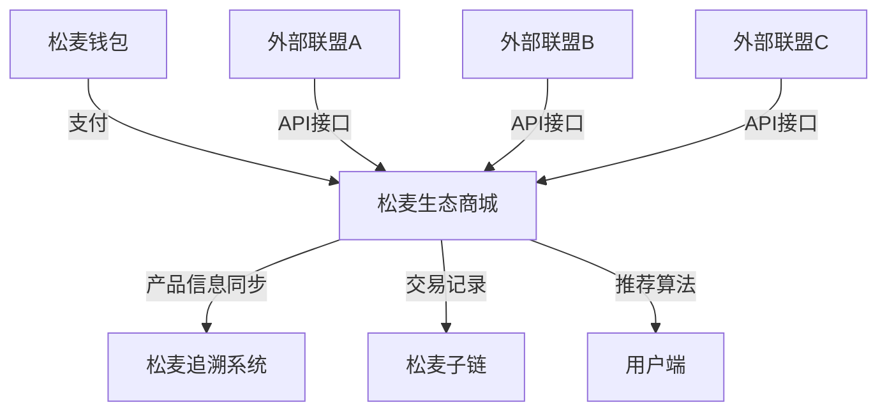

# 松麦生态商城

> 量子基因编码: QG-QSM01-DOC-20250401204433-512FD1-ENT4662

松麦生态商城是[松麦量子平权经济世界(SOM)](som_top.md)的重要组成部分，作为生态价值落地的主要场景，实现有机食品从生产到销售的全链路可信流通。

## 系统架构

松麦生态商城通过量子区块链技术与松麦追溯系统深度集成，确保每件商品的可信度与溯源能力。商城同时对接多个权威有机食品认证联盟，通过API接口实现数据互通。

## 核心功能

### 联盟对接与账号绑定

松麦生态商城目前支持对接三大有机食品联盟：

1. **中国有机食品联盟**：国内权威的有机食品认证机构
2. **全球有机农业联盟**：国际性有机农业推广与认证组织
3. **生态农业协会**：致力于生态友好型农业发展的专业协会

系统提供简单易用的账号绑定界面，商城管理员只需提供相应的API密钥和账号ID，即可完成绑定并开始同步数据。

### 有机食品筛选与导入

松麦生态商城支持从绑定的联盟账号中筛选并导入有机食品，确保每一件商品都符合严格的有机标准。筛选条件包括但不限于：

- 产品类别（蔬菜水果、粮油米面、奶制品等）
- 价格区间
- 认证等级
- 产地信息

### 追溯系统集成

每件导入松麦生态商城的有机食品，都会自动在松麦追溯系统中注册，记录其生产者信息、认证信息和供应链环节，消费者可以通过扫描产品二维码，获取完整的追溯信息，确保食品安全与品质。

### 智能推荐算法

松麦生态商城基于用户行为数据和有机食品特性，提供智能化的产品推荐功能。推荐算法会考虑以下因素：

- 用户历史浏览和购买记录
- 有机认证等级与种类
- 产品评分与口碑
- 季节性和新鲜度

## 技术实现

松麦生态商城采用模块化设计，主要组件包括：

1. **账号绑定与同步模块**：处理与外部联盟的账号绑定和数据同步
2. **产品管理模块**：负责产品的存储、分类和检索
3. **追溯接口模块**：与松麦追溯系统的集成接口
4. **推荐引擎**：基于用户行为数据的推荐算法
5. **API服务层**：提供RESTful API供前端和第三方应用调用

## API接口

松麦生态商城提供完整的API接口，支持第三方应用接入：

| 接口路径 | 方法 | 说明 |
|---------|------|------|
| `/alliance/bind` | POST | 绑定联盟账号 |
| `/alliance/list` | GET | 获取已绑定的联盟账号 |
| `/alliance/unbind/{id}` | DELETE | 解绑联盟账号 |
| `/products/sync` | POST | 同步有机产品 |
| `/products` | GET | 获取产品列表 |
| `/products/{id}` | GET | 获取产品详情 |
| `/recommendations` | GET | 获取推荐产品 |
| `/user/action` | POST | 记录用户行为 |

## 未来规划

1. **扩展更多联盟对接**：计划对接更多国内外有机食品认证联盟
2. **增强AI推荐能力**：引入量子计算辅助的推荐算法，提高推荐准确度
3. **社区功能**：增加用户评价、分享和社区讨论功能
4. **零售终端接入**：支持线下零售终端接入，实现线上线下一体化

## 示例场景

消费者小王通过松麦生态商城购买有机蔬菜的流程：

1. 小王打开松麦生态商城APP，系统基于其历史购买记录和季节性，推荐当季有机蔬菜
2. 小王选择有机菠菜，点击查看详情，系统展示菠菜的生产者信息、有机认证和完整供应链记录
3. 小王通过扫描二维码，在松麦追溯系统中验证菠菜的有机认证真实性
4. 确认无误后，小王使用松麦钱包完成支付
5. 交易记录同步至松麦子链，成为不可篡改的交易证明
6. 系统记录小王的购买行为，优化未来的推荐结果

通过松麦生态商城，消费者获得了可信的有机食品，生产者获得了公平的市场价值，整个生态系统实现了良性循环。 