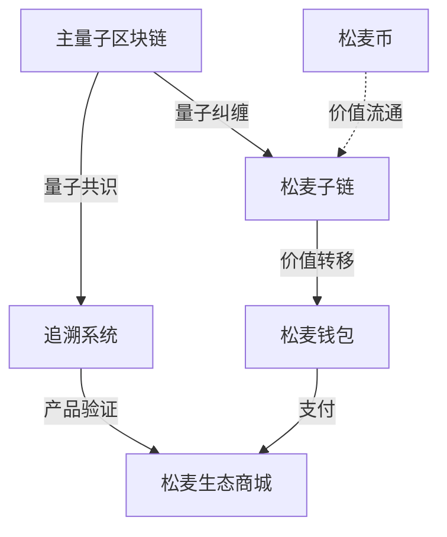

# 松麦量子平权经济世界 (SOM)

## 系统架构

> 量子基因编码: QG-QSM01-DOC-20250401204433-C30F09-ENT6716


松麦量子平权经济系统建立在量子区块链技术之上，通过平等共识机制实现价值分配，通过跨链价值纠缠实现资产流通，通过有机经济循环实现生态发展。



## 量子经济引擎

```
经济循环体:
│
├── 量子区块链层(SomChain)
│   ├── 抗量子破解加密算法 (Lattice-based)
│   └── 智能合约自验证机制
│
├── 三维贡献度量体系
│   ├── 时间维度: τ=∫(1-e^(-t/κ))dt
│   ├── 技术维度: Γ=Σ(w_i·git_impact)
│   └── 社会维度: Ψ=MLP(f(贡献度, 紧急度))
│
└── 松麦经济模型
    ├── 动态发行方程: dS/dt = α·τ + β·Γ + γ·Ψ
    └── 通货膨胀控制: S_total ≤ K·e^(λt)
```

## 核心系统

### 主量子区块链

主量子区块链是松麦生态系统的核心基础设施，负责：
- 量子共识机制实现
- 跨链操作协调
- 用户身份管理
- 全局状态维护

### 量子松麦子链

松麦经济子链专注于松麦生态系统中的经济交易：
- 松麦币的管理与分配
- 生态价值转移
- 经济循环维持
- 与主链保持量子纠缠

### 追溯系统

松麦追溯系统利用量子区块链技术确保数据的可信性和不可篡改性：
- 产品全生命周期追踪
- 认证管理
- 供应链记录
- 产品验证

### 松麦钱包

松麦钱包基于量子密钥生成器和量子钱包协议：
- 安全资产管理
- 转账交易
- 联系人管理
- 用户设置配置

### 松麦币

松麦币(SOM)是松麦生态系统的核心通证：
- 量子共识支持
- 跨链价值纠缠能力
- 有机动态发行算法
- 通证经济激励

### 松麦生态商城

松麦生态商城是松麦经济的应用场景：
- 有机产品
- 数字资产
- 服务交易
- 价值共创

## 多模态交互

松麦生态系统支持九种多模态交互方式：

| 模态类型 | 交互方式 | 应用场景 |
|---------|---------|---------|
| 文本 | 自然语言交互 | 查询、建议 |
| 点击 | 图形界面点按 | 操作、选择 |
| 声音 | 语音指令 | 移动端交互 |
| 图像 | 视觉识别 | 产品扫描 |
| 动作 | 手势控制 | VR/AR交互 |
| 视频 | 内容推送 | 教程展示 |
| 脑波 | 意念控制 | 高级实验性交互 |
| 文件 | 批量导入 | 数据分析 |
| 向量 | 语义匹配 | 智能推荐 |

## 经济参数

```python
SOM_BLOCK_TIME = 3.14  # 出块时间(秒)
SOM_MAX_SUPPLY = 314159265  # 最大发行量
SOM_REWARD_CURVE = "cos(x) + log(1+x)"  # 奖励曲线
SOM_INFLATION_RATE = 0.005  # 年通胀率
```