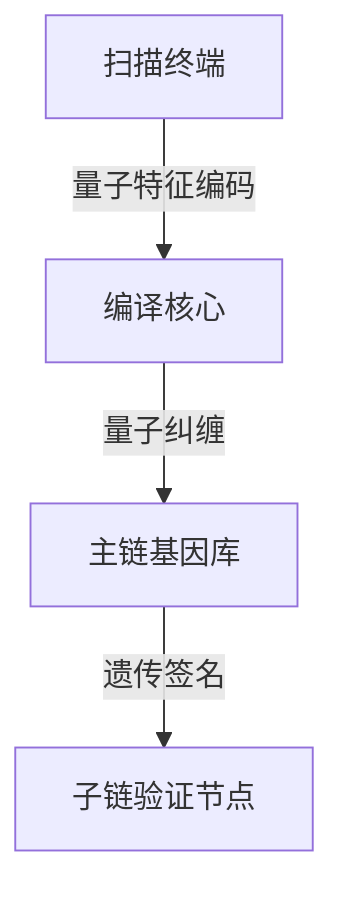

# 量子多媒体扫描识别架构

## 古彝文量子编码协议

> 量子基因编码: QG-QSM01-DOC-20250401204433-78018A-ENT9972

```quantum
Q-MediaProtocol:
  ├── 楔形文字特征提取器
  │   ├── 量子拓扑结构分析
  │   └── 经文纹路量子采样
  ├── 多模态融合引擎
  │   ├── 量子张量融合算法
  │   └── 跨媒体纠缠通道
```

## 量子编译核心
```python
class QuantumMediaCompiler:
    def __init__(self, q_gene):
        self.feature_extractor = QuantumFeatureExtractor(q_gene)
        self.blockchain_encoder = QBlockchainEncoder()

    def quantum_compile(self, media_qubit):
        # 量子特征编译到区块链
        return self.blockchain_encoder.encode(
            self.feature_extractor.quantum_scan(media_qubit)
        ).entangle(main_chain.gene_code)
```

## 多链编译架构


## 遗传验证算法
```cpp
vector<Qubit> verifyMediaGene(QMedia media, QChain sub) {
    return media.quantum_signature
           .entangle(sub.gene_pattern)
           .apply_swap_test(main_chain.epr_pairs);
}
```