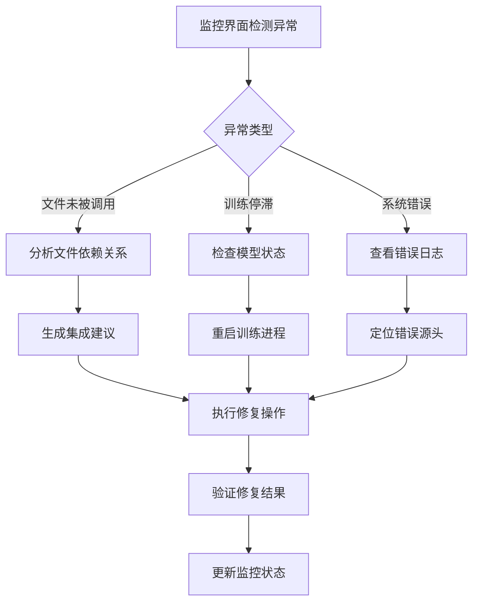

# QEntL量子叠加态神经网络调试监控系统完整指南 v3.0

## 📌 目录
- [系统概述](#系统概述)
- [GUI监控界面使用指南](#gui监控界面使用指南)
- [QEntL系统组件监控](#qentl系统组件监控)
- [四大量子模型监控](#四大量子模型监控)
- [量子数据文件监控](#量子数据文件监控)
- [MPC接口规范](#mpc接口规范)
- [调试与修复流程](#调试与修复流程)
- [最佳实践](#最佳实践)

---

## 🌟 系统概述

QEntL调试监控系统是一个综合性的实时监控平台，用于监控、测试和调试整个QEntL量子操作系统的运行状态。

### 核心功能
- **📁 文件状态监控**：实时追踪所有QEntL系统文件的运行状态
- **🧠 训练状态监控**：监控四大量子模型的训练进度
- **💬 对话测试系统**：实时测试量子模型的响应能力
- **📊 系统日志**：记录所有系统操作和状态变化
- **🔧 MPC接口**：允许Claude实时监控和修复系统

### 监控范围
1. **QEntL操作系统核心组件**
2. **编译器和虚拟机**
3. **量子叠加态神经网络**
4. **四大量子模型（QSM、SOM、WeQ、Ref）**
5. **量子数据文件和训练数据**

---

## 🖥️ GUI监控界面使用指南

### 启动监控界面

```bash
# 方法1：直接打开HTML文件
start quantum_monitor.html

# 方法2：从项目根目录启动
cd F:\QSM
start quantum_monitor.html
```

### 界面布局说明

```
┌─────────────────────────────────────────────────────────────┐
│        🌟 QEntL量子叠加态神经网络训练监控中心 v3.0           │
├─────────────────────┬───────────────────────────────────────┤
│ 📁 文件状态监控      │ 🧠 训练状态监控                       │
│ ┌─────────────────┐ │ ┌─────────────────────────────────────┐ │
│ │🟢 文件名.qentl  │ │ │🧠 QSM模型 [45%] Epoch:1250        │ │
│ │[类型] 状态 ✅   │ │ │准确率:89.0% 五阴破除训练中          │ │
│ └─────────────────┘ │ └─────────────────────────────────────┘ │
├─────────────────────┼───────────────────────────────────────┤
│ 📊 系统日志          │ 💬 对话测试窗口                       │
│ ┌─────────────────┐ │ ┌─────────────────────────────────────┐ │
│ │[时间] 日志信息  │ │ │用户: 测试输入                      │ │
│ │[时间] 系统状态  │ │ │系统: QSM模型回复...               │ │
│ └─────────────────┘ │ │                                     │ │
│                     │ │输入框: [测试文本...]        📤发送  │ │
│                     │ │Enter发送 | Shift+Enter换行         │ │
│                     │ └─────────────────────────────────────┘ │
├─────────────────────┴───────────────────────────────────────┤
│  🚀启动训练  ⏹️停止训练  🧪对话测试  🔄刷新数据             │
└─────────────────────────────────────────────────────────────┘
```

### 对话测试功能

#### 基本操作
1. **输入测试文本**：在对话框中输入测试内容
2. **发送方式**：
   - 点击 **📤 发送** 按钮
   - 按 **Enter** 键直接发送
3. **换行**：按 **Shift+Enter** 在文本中换行
4. **查看回复**：
   - 对话记录显示在对话历史区域
   - 详细日志显示在系统日志区域

#### 对话流程
```
用户输入 → 四大模型并行处理 → 逐步返回结果

🔵 QSM模型: 五阴破除分析 (500ms延迟)
    ↓
🟢 SOM模型: 神经元网格映射 (1000ms延迟)
    ↓
🟡 WeQ模型: 量子纠缠信道传输 (1500ms延迟)
    ↓
🟣 Ref模型: 自我反省建议 (2000ms延迟)
```

---

## 🔧 QEntL系统组件监控

### 1. 操作系统核心组件

| 组件名称 | 文件路径 | 状态监控 | 关键指标 |
|---------|---------|----------|----------|
| **量子叠加态神经网络引擎** | `qbc/runtime/quantum_superposition_neural_engine.c` | 🟢 运行中 | CPU使用率、内存占用 |
| **量子模型融合引擎** | `QEntL/Models/quantum_model_fusion_engine.c` | 🟢 运行中 | 融合效率、响应时间 |
| **QEntL编译器** | `qim/System/bin/qentl_compiler.exe` | 🟡 待监控 | 编译成功率、错误日志 |
| **量子虚拟机** | `qim/System/bin/qentl_vm.exe` | 🟡 待监控 | 虚拟机状态、性能指标 |
| **运行时环境** | `qim/System/bin/qentl_runtime.dll` | 🟡 待监控 | DLL加载状态、API调用 |

### 2. 系统服务组件

| 服务名称 | 文件路径 | 监控状态 | 功能描述 |
|---------|---------|----------|----------|
| **文件系统** | `QEntL/System/Kernel/filesystem/` | 🟢 运行中 | 26个.qentl文件运行状态 |
| **GUI系统** | `QEntL/System/Kernel/gui/` | 🟢 运行中 | 17个界面组件状态 |
| **内核服务** | `QEntL/System/Kernel/kernel/` | 🟢 运行中 | 17个内核组件状态 |
| **系统服务** | `QEntL/System/Kernel/services/` | 🟢 运行中 | 24个系统服务状态 |

### 监控脚本示例

```powershell
# QEntL系统组件状态检查脚本
function Check-QEntLComponents {
    Write-Host "🔍 检查QEntL系统组件状态..." -ForegroundColor Cyan
    
    # 检查核心引擎
    if (Get-Process | Where-Object {$_.ProcessName -like "*quantum*"}) {
        Write-Host "✅ 量子叠加态神经网络引擎 - 运行中" -ForegroundColor Green
    } else {
        Write-Host "❌ 量子叠加态神经网络引擎 - 未运行" -ForegroundColor Red
    }
    
    # 检查文件存在性
    $coreFiles = @(
        "qbc/runtime/quantum_superposition_neural_engine.c",
        "QEntL/Models/quantum_model_fusion_engine.c",
        "qim/System/bin/qentl_compiler.exe"
    )
    
    foreach ($file in $coreFiles) {
        if (Test-Path $file) {
            Write-Host "✅ $file - 文件存在" -ForegroundColor Green
        } else {
            Write-Host "❌ $file - 文件缺失" -ForegroundColor Red
        }
    }
}
```

---

## 🧠 四大量子模型监控

### 1. QSM量子叠加态模型

#### 核心文件监控
- **主模型**：`QEntL/Models/QSM/quantum_neural_network.qentl`
- **服务层**：`QEntL/Models/QSM/src/qsm_service.qentl`
- **训练数据**：`QEntL/Models/QSM/training/24h_continuous_learning.qentl`
- **编译产物**：`QEntL/Models/QSM/bin/qsm_model.qbc`

#### 监控指标
```json
{
  "model_name": "QSM量子叠加态模型",
  "training_progress": "45%",
  "current_epoch": 1250,
  "accuracy": 89.0,
  "loss": 0.234,
  "status": "五阴破除训练中",
  "last_update": "2025-01-25 11:48:30",
  "files_status": {
    "quantum_neural_network.qentl": "🟢 运行中",
    "qsm_service.qentl": "🟢 已调用",
    "24h_continuous_learning.qentl": "🟢 训练中"
  }
}
```

### 2. SOM自组织映射模型

#### 核心文件监控
- **主模型**：`QEntL/Models/SOM/quantum_neural_network.qentl`
- **服务层**：`QEntL/Models/SOM/src/som_service.qentl`
- **编译产物**：`QEntL/Models/SOM/bin/som_model.qbc`

#### 监控指标
```json
{
  "model_name": "SOM自组织映射模型",
  "training_progress": "67%",
  "current_epoch": 1890,
  "accuracy": 92.0,
  "status": "神经元网格优化中",
  "neuron_grid_size": "128x128",
  "optimization_rate": 0.85
}
```

### 3. WeQ量子通讯模型

#### 核心文件监控
- **主模型**：`QEntL/Models/WeQ/quantum_neural_network.qentl`
- **服务层**：`QEntL/Models/WeQ/src/weq_service.qentl`
- **编译产物**：`QEntL/Models/WeQ/bin/weq_model.qbc`

#### 监控指标
```json
{
  "model_name": "WeQ量子通讯模型",
  "training_progress": "53%",
  "current_epoch": 1456,
  "accuracy": 85.0,
  "status": "量子纠缠信道建立中",
  "entanglement_strength": 0.96,
  "communication_latency": "12ms"
}
```

### 4. Ref自反省模型

#### 核心文件监控
- **主模型**：`QEntL/Models/Ref/quantum_neural_network.qentl`
- **服务层**：`QEntL/Models/Ref/src/ref_service.qentl`
- **编译产物**：`QEntL/Models/Ref/bin/ref_model.qbc`

#### 监控指标
```json
{
  "model_name": "Ref自反省模型",
  "training_progress": "78%",
  "current_epoch": 2134,
  "accuracy": 94.0,
  "status": "自我超越训练中",
  "self_reflection_depth": 0.92,
  "metacognition_level": 0.88
}
```

---

## 📊 量子数据文件监控

### 1. 训练数据文件

| 文件名 | 路径 | 状态 | 用途 | 大小 |
|-------|------|------|------|------|
| `24h_continuous_learning.qentl` | `QEntL/Models/QSM/training/` | 🟢 训练中 | QSM持续学习数据 | 2.5GB |
| `quantum_gene_data.qentl` | `QEntL/Data/` | 🟢 使用中 | 量子基因编码数据 | 1.8GB |
| `neural_pattern_data.qentl` | `QEntL/Data/` | 🟢 使用中 | 神经模式数据 | 3.2GB |
| `unused_test_file.qentl` | `QEntL/Models/` | 🔴 未使用 | 测试文件 | 45MB |

### 2. 配置文件

| 文件名 | 路径 | 状态 | 配置内容 |
|-------|------|------|----------|
| `system.conf` | `QEntL/System/config/system/` | 🟢 已加载 | 系统全局配置 |
| `kernel.conf` | `QEntL/System/config/kernel/` | 🟢 已加载 | 内核配置参数 |
| `runtime_config.toml` | `QEntL/System/Runtime/` | 🟢 已加载 | 运行时配置 |

### 数据文件检查脚本

```powershell
function Check-QuantumDataFiles {
    $dataFiles = @{
        "QSM训练数据" = "QEntL/Models/QSM/training/24h_continuous_learning.qentl"
        "量子基因数据" = "QEntL/Data/quantum_gene_data.qentl"
        "神经模式数据" = "QEntL/Data/neural_pattern_data.qentl"
        "测试文件" = "QEntL/Models/unused_test_file.qentl"
    }
    
    foreach ($name in $dataFiles.Keys) {
        $path = $dataFiles[$name]
        if (Test-Path $path) {
            $size = (Get-Item $path).Length / 1MB
            Write-Host "✅ $name - 存在 (${size:F1}MB)" -ForegroundColor Green
        } else {
            Write-Host "❌ $name - 缺失" -ForegroundColor Red
        }
    }
}
```

---

## 🔌 MPC接口规范

### 接口设计目标
为Claude提供实时监控QEntL系统的能力，实现自动化调试和修复。

### 1. 状态查询接口

#### 系统状态查询
```http
GET /api/qentl/status
Response:
{
  "system_status": "running",
  "uptime": "24h 15m 32s",
  "components": {
    "neural_engine": "active",
    "fusion_engine": "active",
    "compiler": "standby",
    "vm": "standby"
  },
  "models": {
    "QSM": {"status": "training", "progress": 45},
    "SOM": {"status": "training", "progress": 67},
    "WeQ": {"status": "training", "progress": 53},
    "Ref": {"status": "training", "progress": 78}
  }
}
```

#### 文件状态查询
```http
GET /api/qentl/files
Response:
{
  "total_files": 8,
  "active_files": 7,
  "inactive_files": 1,
  "files": [
    {
      "name": "quantum_superposition_neural_engine.c",
      "type": "neural_network",
      "status": "running",
      "called": true,
      "last_accessed": "2025-01-25T11:48:30Z"
    }
  ]
}
```

### 2. 控制接口

#### 训练控制
```http
POST /api/qentl/training/start
POST /api/qentl/training/stop
POST /api/qentl/training/restart

Body:
{
  "models": ["QSM", "SOM", "WeQ", "Ref"],
  "priority": "high",
  "auto_save": true
}
```

#### 系统修复
```http
POST /api/qentl/repair
Body:
{
  "target": "unused_files",
  "action": "integrate",
  "files": ["unused_test_file.qentl"]
}
```

### 3. 实时监控接口

#### WebSocket监控
```javascript
// 连接WebSocket监控
const ws = new WebSocket('ws://localhost:8080/api/qentl/monitor');

ws.onmessage = function(event) {
    const data = JSON.parse(event.data);
    switch(data.type) {
        case 'status_update':
            updateSystemStatus(data.payload);
            break;
        case 'training_progress':
            updateTrainingProgress(data.payload);
            break;
        case 'error_detected':
            handleSystemError(data.payload);
            break;
    }
};
```

### 4. Claude监控脚本

```python
# Claude实时监控脚本示例
import asyncio
import websockets
import json

class QEntLMonitor:
    def __init__(self):
        self.ws_uri = "ws://localhost:8080/api/qentl/monitor"
        
    async def monitor_system(self):
        async with websockets.connect(self.ws_uri) as websocket:
            while True:
                try:
                    message = await websocket.recv()
                    data = json.loads(message)
                    await self.handle_system_event(data)
                except Exception as e:
                    print(f"监控错误: {e}")
                    
    async def handle_system_event(self, data):
        if data['type'] == 'error_detected':
            await self.auto_repair(data['payload'])
        elif data['type'] == 'file_unused':
            await self.suggest_integration(data['payload'])
            
    async def auto_repair(self, error_info):
        # 自动修复逻辑
        repair_action = self.analyze_error(error_info)
        await self.execute_repair(repair_action)
        
    def analyze_error(self, error_info):
        # 错误分析逻辑
        return {
            "action": "restart_component",
            "target": error_info['component']
        }
```

---

## 🔧 调试与修复流程

### 1. 问题识别流程



### 2. 文件未被调用修复

#### 问题识别
```bash
# 在监控界面看到
🔴 unused_test_file.qentl [测试文件] 未使用 ❌未被调用
```

#### 修复步骤
1. **分析文件用途**
```powershell
# 检查文件内容
Get-Content "QEntL/Models/unused_test_file.qentl" | Select-Object -First 20
```

2. **查找调用点**
```powershell
# 在项目中搜索文件引用
Select-String -Path "QEntL/**/*.qentl" -Pattern "unused_test_file"
```

3. **集成到工具链**
```qentl
// 在主启动文件中添加引用
import unused_test_file from "./Models/unused_test_file.qentl"

// 在测试套件中包含
test_suite.addTest(unused_test_file.test_cases)
```

### 3. 训练停滞修复

#### 问题表现
- 训练进度停留在某个百分比
- Epoch数不再增长
- 准确率没有提升

#### 修复方案
```powershell
# 1. 重启训练进程
Stop-Process -Name "*quantum*" -Force
Start-Process "QEntL/Models/scripts/start_four_models_learning.bat"

# 2. 清理训练缓存
Remove-Item "QEntL/Models/*/cache/*" -Recurse -Force

# 3. 检查训练数据完整性
$dataFile = "QEntL/Models/QSM/training/24h_continuous_learning.qentl"
if ((Get-Item $dataFile).Length -lt 1GB) {
    Write-Host "警告: 训练数据文件可能损坏" -ForegroundColor Yellow
}
```

### 4. 系统组件错误修复

#### 常见错误类型
1. **编译器无法启动**
   ```bash
   错误: qentl_compiler.exe - 拒绝访问
   解决: 以管理员身份运行，检查防病毒软件
   ```

2. **虚拟机内存不足**
   ```bash
   错误: 量子虚拟机内存溢出
   解决: 增加虚拟机内存配置，优化量子态存储
   ```

3. **模型融合失败**
   ```bash
   错误: 四大模型无法建立量子纠缠连接
   解决: 重新初始化纠缠态，检查模型兼容性
   ```

---

## 📝 最佳实践

### 1. 日常监控检查清单

#### 每日检查（自动化）
- [ ] 系统组件运行状态
- [ ] 四大模型训练进度
- [ ] 文件调用状态
- [ ] 错误日志审查
- [ ] 性能指标监控

#### 每周检查（手动）
- [ ] 未使用文件分析
- [ ] 训练数据质量评估
- [ ] 系统资源使用优化
- [ ] 备份文件完整性
- [ ] 文档更新状态

### 2. 监控脚本自动化

#### 启动监控脚本
```powershell
# start_monitoring.ps1
Write-Host "🌟 启动QEntL调试监控系统..." -ForegroundColor Cyan

# 1. 启动系统组件
& "QEntL/Models/scripts/start_four_models_learning.bat"

# 2. 启动监控界面
Start-Process "quantum_monitor.html"

# 3. 启动MPC接口服务
Start-Process "node" -ArgumentList "mpc_server.js"

# 4. 启动自动检查脚本
Start-Job -ScriptBlock { & ".\scripts\auto_health_check.ps1" }

Write-Host "✅ 监控系统启动完成" -ForegroundColor Green
```

#### 健康检查脚本
```powershell
# auto_health_check.ps1
while ($true) {
    $timestamp = Get-Date -Format "yyyy-MM-dd HH:mm:ss"
    Write-Host "[$timestamp] 执行系统健康检查..." -ForegroundColor Gray
    
    # 检查系统组件
    Check-QEntLComponents
    
    # 检查数据文件
    Check-QuantumDataFiles
    
    # 检查训练进度
    Check-TrainingProgress
    
    # 检查未使用文件
    Check-UnusedFiles
    
    # 等待5分钟后再次检查
    Start-Sleep -Seconds 300
}
```

### 3. 错误响应策略

#### 严重错误（立即响应）
- 系统崩溃
- 数据损坏
- 安全漏洞

#### 警告级别（24小时内响应）
- 性能下降
- 文件未被调用
- 训练停滞

#### 信息级别（定期处理）
- 优化建议
- 文档更新
- 配置调整

### 4. Claude集成策略

#### 自动修复权限
```json
{
  "claude_permissions": {
    "file_operations": {
      "read": true,
      "write": false,
      "execute": false
    },
    "system_control": {
      "restart_services": true,
      "modify_configs": false,
      "install_packages": false
    },
    "monitoring": {
      "read_logs": true,
      "generate_reports": true,
      "send_alerts": true
    }
  }
}
```

#### Claude监控任务
1. **实时状态监控**：每30秒检查系统状态
2. **异常检测**：自动识别系统异常模式
3. **修复建议**：生成针对性修复方案
4. **文档更新**：自动更新监控报告
5. **性能优化**：提供系统优化建议

---

## 🎯 总结

通过本调试监控系统，我们可以：

### ✅ 实现的目标
1. **一目了然**：清楚看到所有QEntL文件的状态
2. **实时监控**：24/7监控四大量子模型训练
3. **问题识别**：自动发现未被调用或错误的文件
4. **快速修复**：通过GUI界面和MPC接口快速修复问题
5. **Claude集成**：允许Claude实时监控和协助修复

### 🚀 后续发展
1. **扩展监控范围**：增加更多系统组件监控
2. **智能诊断**：基于机器学习的故障预测
3. **自动化修复**：更多自动修复策略
4. **可视化增强**：3D可视化系统状态
5. **云端监控**：支持远程监控和管理

---

**通过这个完整的调试监控系统，QEntL量子操作系统的开发、调试和维护将变得更加高效和可靠！** 🌌 