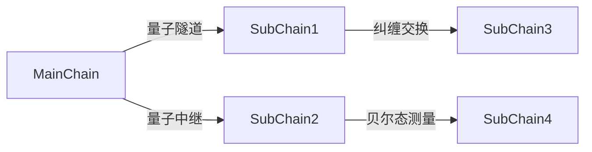

# 量子通信架构设计规范

## 量子纠缠网络协议

> 量子基因编码: QG-QSM01-DOC-20250401204432-1A5C81-ENT5644

```quantum
Q-CommProtocol:
  ├── 多节点EPR对制备
  │   ├── 贝尔态分发算法
  │   └── 量子中继路由协议
  ├── 跨链通信机制
  │   ├── 量子隐形传态隧道
  │   └── 纠缠交换验证矩阵
```

## 量子通信核心引擎
```python
class QuantumCommunicationEngine:
    def __init__(self, q_gene):
        self.epr_generator = EPRPairGenerator(q_gene)
        self.quantum_routing = QuantumRoutingProtocol()

    def establish_channel(self, target_node):
        # 量子纠缠信道建立
        epr_pairs = self.epr_generator.generate_chain()
        return self.quantum_routing.entangle(target_node, epr_pairs)
```

## 多链通信架构


## 遗传验证算法
```cpp
vector<Qubit> verifyCommGene(QChain main, QNode node) {
    return main.comm_gene
           .entangle(node.epr_signature)
           .apply_teleport_test(main.epr_pool);
}
```