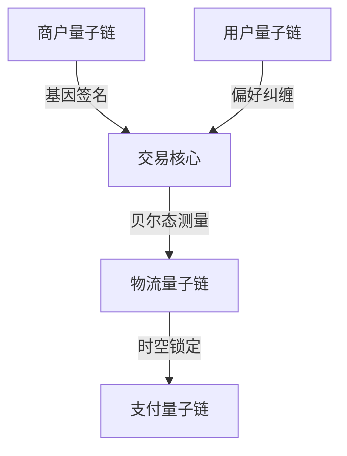

# 松麦生态分布式电商架构

## 量子基因交互协议

> 量子基因编码: QG-QSM01-DOC-20250401204432-013E3B-ENT1764

```quantum
Q-EcoProtocol:
  ├── 量子商户端基因编码器
  │   ├── 商品特征量子哈希
  │   └── 供应链拓扑量子签名
  ├── 量子用户端验证环
  │   ├── 偏好基因纠缠匹配
  │   └── 贝尔态交易验证
```

## 量子交易核心
```python
class QuantumEcoEngine:
    def __init__(self, q_gene):
        self.merchant_encoder = QuantumMerchantEncoder(q_gene)
        self.user_validator = QuantumUserValidator()

    def quantum_transaction(self, order_qubit):
        # 量子基因驱动交易验证
        return self.user_validator.verify(
            self.merchant_encoder.encode_order(order_qubit)
        ).apply_entanglement_swap()
```

## 生态量子架构


## 遗传验证算法
```cpp
vector<Qubit> verifyEcoGene(QChain merchant, QChain user) {
    return merchant.business_gene
           .entangle(user.preference_gene)
           .apply_temporal_test(main_chain.epr_pool);
}
```