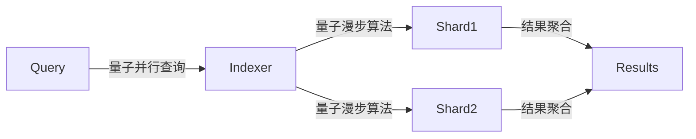

# 量子分布式数据库架构

## 量子隐形传态协议

> 量子基因编码: QG-QSM01-DOC-20250401204433-6F35D4-ENT3984

```quantum
Q-DataSync:
  ├── 量子数据分片(Shard_Qubit)
  │   ├── 贝尔态制备
  │   └── 量子态远程克隆
  ├── 跨节点同步机制
  │   ├── 量子中继路由
  │   └── 纠缠交换验证
```

## 分形存储引擎
```python
class FractalStorageEngine:
    def __init__(self, q_gene):
        self.storage_shards = QuantumShardCluster(q_gene)
        self.entanglement_network = QubitEntanglementNetwork()

    def quantum_replicate(self, data_qubits):
        # 量子隐形传态实现数据同步
        self.entanglement_network.create_EPR_pairs()
        return self.storage_shards.apply_teleportation(data_qubits)
```

## 多维度检索协议


## 遗传验证矩阵
```cpp
vector<QubitSignature> verifyDataGene(QShard main, QShard sub) {
    return main.entanglement_map
           .project(sub.gene_signature)
           .apply_swap_test();
}
```