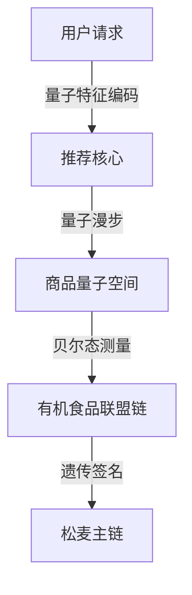

# 量子搜索引擎与推荐引擎架构

## 量子语义理解协议

> 量子基因编码: QG-QSM01-DOC-20250401204433-56A1B3-ENT9633

```quantum
Q-SemanticProtocol:
  ├── 古彝文量子编码器
  │   ├── 楔形文字量子特征提取
  │   └── 经文拓扑结构分析
  ├── 多模态融合引擎
  │   ├── 量子张量融合算法
  │   └── 跨模态纠缠通道
```

## 量子推荐核心
```python
class QuantumRecommendCore:
    def __init__(self, q_gene):
        self.query_entangler = QuantumEntanglementMatrix(q_gene)
        self.recommend_walker = QuantumWalkSolver()

    def parallel_recommend(self, user_qubit):
        # 量子漫步实现跨维度推荐
        return self.recommend_walker.solve(
            self.query_entangler.apply(user_qubit)
        ).collapse()
```

## 松麦电商推荐架构


## 遗传验证算法
```cpp
vector<Qubit> verifyRecommendGene(QUser user, QProduct product) {
    return user.preference_gene
           .entangle(product.gene_code)
           .apply_swap_test(main_chain.epr_pairs);
}
```