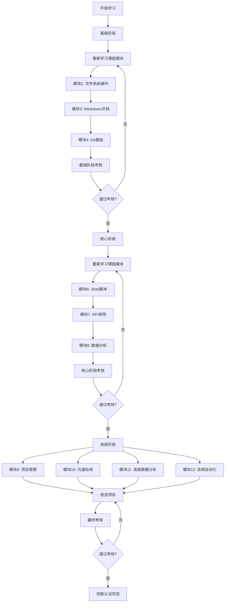

# 学习路径

## 学习路径概述

本课程采用渐进式学习路径，从基础到高级，从简单到复杂，确保学员能够逐步建立完整的技能体系。学习路径分为三个阶段，每个阶段包含多个模块，学员需要按顺序完成各模块的学习和考核。

## 学习路径图

## 详细学习路径

### 第一阶段：基础阶段（预计学习时间：2-3周）

#### 第1周：工具基础
- **第1-2天**：模块1 - 命令行操作基础
  - 学习命令行基本概念
  - 练习常用命令
  - 完成命令行练习任务
- **第3-4天**：模块2 - 文件系统操作
  - 学习文件管理
  - 练习权限和查找操作
  - 完成文件操作任务
- **第5天**：模块1-2综合练习
  - 结合命令行和文件操作
  - 完成综合任务
  - 复习和巩固

#### 第2周：文档与版本控制
- **第1-2天**：模块3 - Markdown文档编写
  - 学习Markdown语法
  - 编写技术文档
  - 完成文档编写任务
- **第3-4天**：模块4 - Git版本控制基础
  - 学习Git基本操作
  - 练习分支和合并
  - 完成版本控制任务
- **第5天**：基础阶段复习
  - 综合复习所有模块
  - 准备阶段考核
  - 查漏补缺

#### 基础阶段考核
- **理论知识测试**（30分钟）
- **实践操作测试**（60分钟）
- **通过标准**：90%以上正确率

### 第二阶段：核心阶段（预计学习时间：3-4周）

#### 第3周：编程基础
- **第1-3天**：模块5 - Python编程基础
  - 学习Python语法
  - 练习数据处理
  - 完成编程练习
- **第4-5天**：模块6 - Shell脚本编写
  - 学习Shell脚本
  - 练习自动化任务
  - 完成脚本编写

#### 第4周：数据处理
- **第1-3天**：模块7 - API调用与数据处理
  - 学习API调用
  - 练习数据处理
  - 完成API项目
- **第4-5天**：模块8 - 数据分析基础
  - 学习数据分析
  - 练习数据可视化
  - 完成分析报告

#### 第5周：核心阶段综合
- **第1-2天**：综合项目实践
  - 结合Python、Shell、API、数据分析
  - 完成综合数据项目
- **第3-4天**：核心阶段复习
  - 综合复习所有模块
  - 准备阶段考核
- **第5天**：核心阶段考核

#### 核心阶段考核
- **理论知识测试**（45分钟）
- **实践项目测试**（120分钟）
- **通过标准**：90%以上正确率

### 第三阶段：高级阶段（预计学习时间：4-5周）

#### 第6-7周：高级技能学习
- **学员根据工作方向选择2-3个模块**
- **模块9**：项目管理基础（2周）
- **模块10**：沟通协调技巧（1周）
- **模块11**：高级数据分析（2周）
- **模块12**：系统自动化（2周）

#### 第8周：项目实践
- **项目启动**：确定项目目标和范围
- **项目规划**：制定详细实施计划
- **项目执行**：按照计划实施项目
- **项目监控**：跟踪进度和解决问题
- **项目交付**：完成项目并提交成果

#### 第9周：最终考核
- **项目评审**：项目成果展示和评审
- **综合测试**：理论知识综合测试
- **技能评估**：实际操作能力评估
- **伦理评估**：伦理决策能力评估

## 个性化学习路径

### 快速学习路径
适合有相关基础的学员：
- **压缩学习时间**：每个模块学习时间减少30%
- **重点学习**：跳过熟悉内容，专注薄弱环节
- **加速考核**：提前进行阶段考核

### 强化学习路径
适合需要额外支持的学员：
- **延长学习时间**：每个模块增加50%学习时间
- **额外练习**：提供更多练习和指导
- **分步考核**：将考核分解为多个小考核

### 专业方向路径
根据工作职责选择不同方向：

#### 开发方向
- 重点：模块5、6、7、12
- 项目：系统自动化工具开发

#### 数据分析方向
- 重点：模块7、8、11
- 项目：数据分析平台开发

#### 项目管理方向
- 重点：模块9、10
- 项目：项目管理流程优化

## 学习资源支持

### 同步学习资源
- **每日学习指南**：每天的学习目标和任务
- **视频教程**：关键概念的视频讲解
- **在线练习**：交互式练习环境
- **代码示例**：完整的示例代码库

### 异步学习资源
- **参考文档**：详细的参考手册
- **常见问题**：常见问题解答库
- **社区论坛**：学员交流平台
- **最佳实践**：行业最佳实践案例

### 学习支持服务
- **导师指导**：一对一导师支持
- **学习小组**：小组学习和讨论
- **答疑时间**：定期答疑会议
- **进度跟踪**：学习进度跟踪和反馈

## 学习进度评估

### 日常评估
- **每日练习完成度**
- **每日学习时间统计**
- **每日问题解决情况**

### 阶段评估
- **每周学习进度报告**
- **模块考核成绩**
- **阶段考核成绩**

### 综合评估
- **学习效率评估**
- **技能掌握程度评估**
- **学习态度评估**

## 学习路径调整机制

### 进度调整
- **超前进度**：可以提前进入下一阶段
- **滞后进度**：提供额外支持和时间
- **学习困难**：调整学习方法和资源

### 内容调整
- **内容过时**：更新最新技术和工具
- **内容不足**：补充缺失的知识点
- **内容冗余**：精简重复和次要内容

### 路径调整
- **方向调整**：根据兴趣调整专业方向
- **难度调整**：根据能力调整学习难度
- **节奏调整**：根据时间调整学习节奏

## 伦理学习路径

### 伦理意识培养
- **贯穿所有模块**：每个技能模块包含伦理考量
- **专门伦理模块**：伦理培训第一讲、第二讲、第三讲
- **伦理案例学习**：实际工作中的伦理案例

### 伦理实践训练
- **伦理决策练习**：模拟伦理决策场景
- **伦理风险评估**：识别和评估伦理风险
- **伦理问题解决**：解决实际伦理问题

### 伦理行为评估
- **日常伦理行为**：日常工作中的伦理表现
- **项目伦理评估**：项目中的伦理合规性
- **综合伦理评估**：全面的伦理能力评估

---
**版本**: v0.1.0
**创建日期**: 2026-02-07
**更新日期**: 2026-02-07
**状态**: 草案